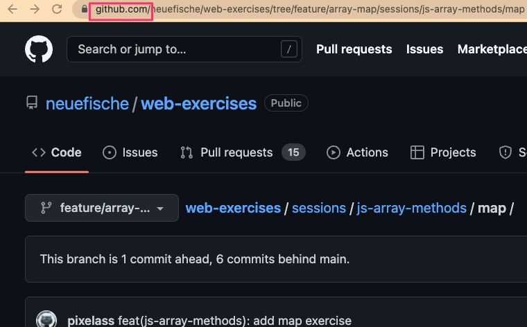
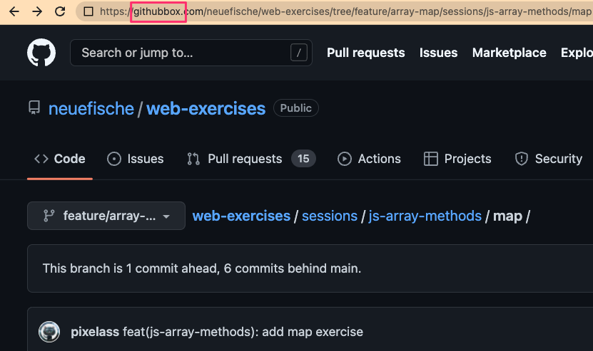
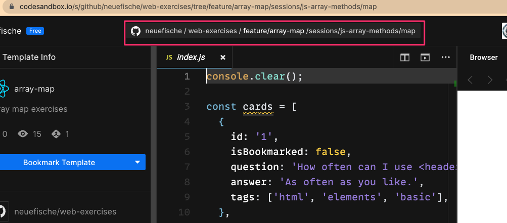

# web exercises

Exercises for the neuefische web bootcamps.

These exercises are tailored as templates for codesandbox

<!-- toc -->

- [web exercises](#web-exercises)
  - [Generate Codesandbox from GitHub](#generate-codesandbox-from-github)
  - [Adding new exercises](#adding-new-exercises)
  - [Review new or changed exercises](#review-new-or-changed-exercises)
  - [Update exercises](#update-exercises)
  - [OPTIONAL: Import project to Codesandbox](#optional-import-project-to-codesandbox)

<!-- tocstop -->

---

## Generate Codesandbox from GitHub

1. Open the folder in GitHub
2. change the URL from `github.com` to `githubbox.com`
   - Before: https://github.com/neuefische/web-exercises/tree/feature/array-map/sessions/js-array-methods/map
   - After: https://githubbox.com/neuefische/web-exercises/tree/feature/array-map/sessions/js-array-methods/map

---

## Adding new exercises

In order to satisfy our review process, please follow these steps:

1. Open a new branch following our [Branch guidelines](./docs/BRANCHES.md)
2. Go to [codesandbox](https://codesandbox.io/) and create a new Project there.
3. Create your exercise in codesandbox.
4. Download the project to you local machine.
5. Add the downloaded project in the desired folder/session:  
   Example: `sessions/js-array-methods/`
6. Commit the changes following [Commit guidelines](./docs/COMMITS.md)
7. Open a new pull request
8. Wait until the pull request has at least 2 approvals (enforced by branch protection)
9. Add the GitHubBox link to the session exercise (This URL will generate a sandbox from the current main)

Example: https://githubbox.com/neuefische/web-exercises/tree/main/sessions/react-props-01

---

## Review new or changed exercises

1. Switch to the branch on GitHub
2. Use the folder from that branch
3. Follow step 2 from [Generate Codesandbox from GitHub](#generate-codesandbox-from-github)
4. Solve the exercise and save the sandbox
5. Add your solution as a comment on the pull request

---

## Update exercises

Once a pull request has been approved and squashed onto the main branch, solutions can be added to
our [Sessions on Codesandbox](https://codesandbox.io/dashboard/all/sessions).

Since we generate the exercises from the GitHub folder, we don't have to update the example starters

Example: https://codesandbox.io/dashboard/all/sessions/js-array-methods

1. Delete old solutions
2. Add new session in designated folder
3. Add solutions with suffix `(solution 01)`

> Each exercise should have two independent solutions.

Example: https://codesandbox.io/dashboard/all/sessions/examples

---

## OPTIONAL: Import project to Codesandbox

> This guide uses the ["javascript"](./tpl/javascript) template from [the template folder](./tpl)

1. Open https://codesandbox.io/
2. Create a new sandbox
3. Choose the "Import Project" tab
4. Enter the URL to the folder that hosts the exercise
5. Click the "Import and Fork" button
6. Congratulation: You created a Sandbox from a GitHub folder

