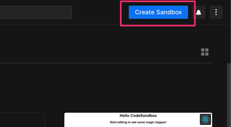
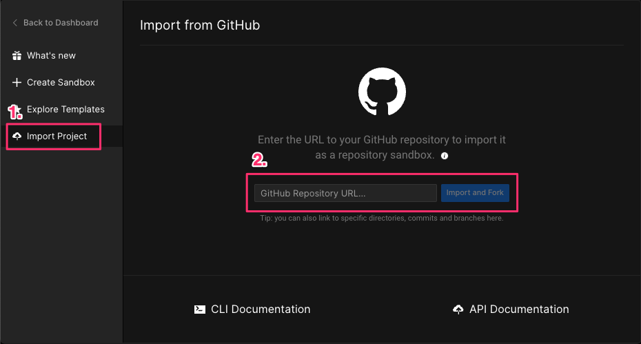
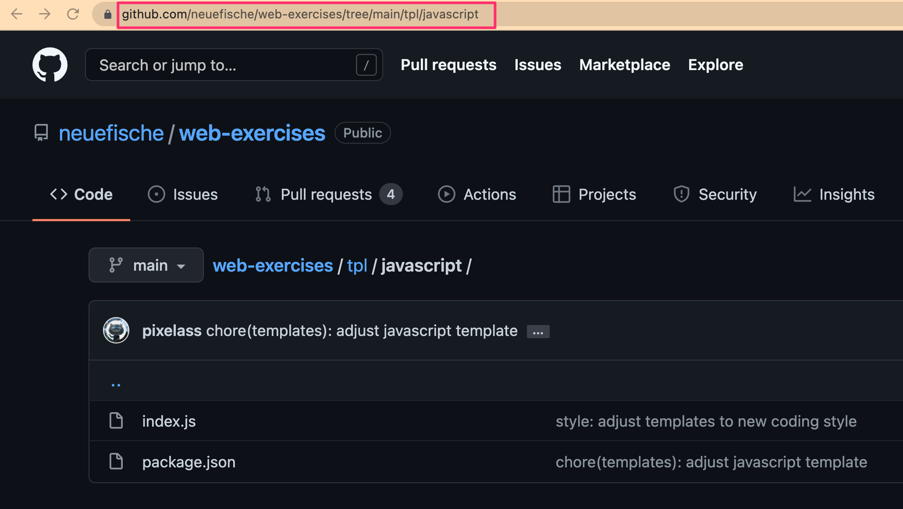
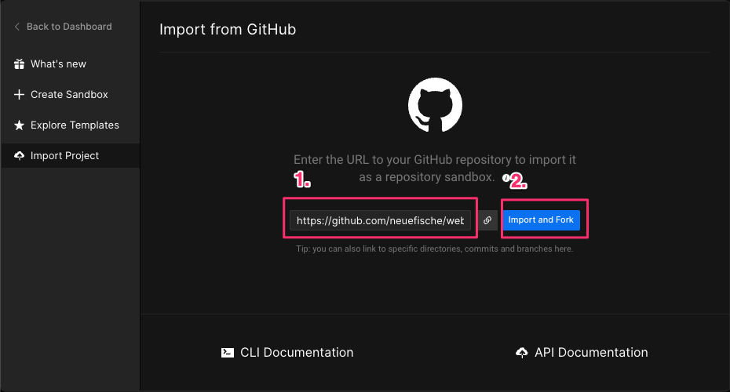
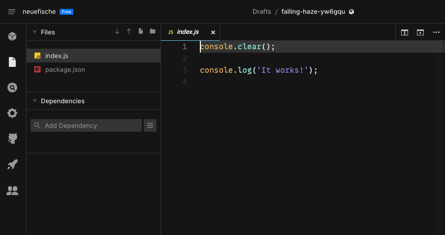
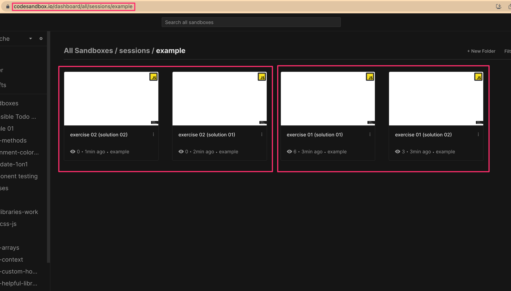

# web-exercise

Exercises for the neuefische web bootcamps.

These exercises are tailored as templates for codesandbox

<!-- toc -->

- [Import project to Codesandbox](#import-project-to-codesandbox)
- [Adding new exercises](#adding-new-exercises)
- [Review new or changed exercises](#review-new-or-changed-exercises)
- [Update exercises](#update-exercises)

<!-- tocstop -->

---

## Import project to Codesandbox

> This guide uses the ["javascript"](./tpl/javascript) template from [the template folder](./tpl)

1. Open https://codesandbox.io/
2. Create a new sandbox
3. Choose the "Import Project" tab
4. Enter the URL to the folder that hosts the exercise
5. Click the "Import and Fork" button
6. Congratulation: You created a Sandbox from a GitHub folder

---

## Adding new exercises

In order to satisfy our review process, please follow these steps:

1. Open a new branch following our [Branch guidelines](./docs/BRANCHES.md)
2. Add a new project in the desired folder/session:  
   Example: `sessions/js-array-methods/`
3. Commit the changes following [Commit guidelines](./docs/COMMITS.md)
4. Open a new pull request
5. Wait until the pull request has at least 2 approvals (enforced by branch protection)

---

## Review new or changed exercises

1. Switch to the branch on GitHub
2. Use the folder from that branch
3. Follow the steps 1 - 6 from [Import project to Codesandbox](#import-project-to-codesandbox)
4. Solve the exercise and save the sandbox
5. Add your solution as a comment on the pull request

---

## Update exercises

Once a pull request has been approved and squashed onto the main branch, we can add it to our [Sessions on Codesandbox](https://codesandbox.io/dashboard/all/sessions)

Example: https://codesandbox.io/dashboard/all/sessions/js-array-methods

1. Delete old exercises and solutions
2. Add new session in designated folder
3. Add solutions with suffix `(solution 01)`

> Each exercise should have two independent solutions.

Example: https://codesandbox.io/dashboard/all/sessions/examples

