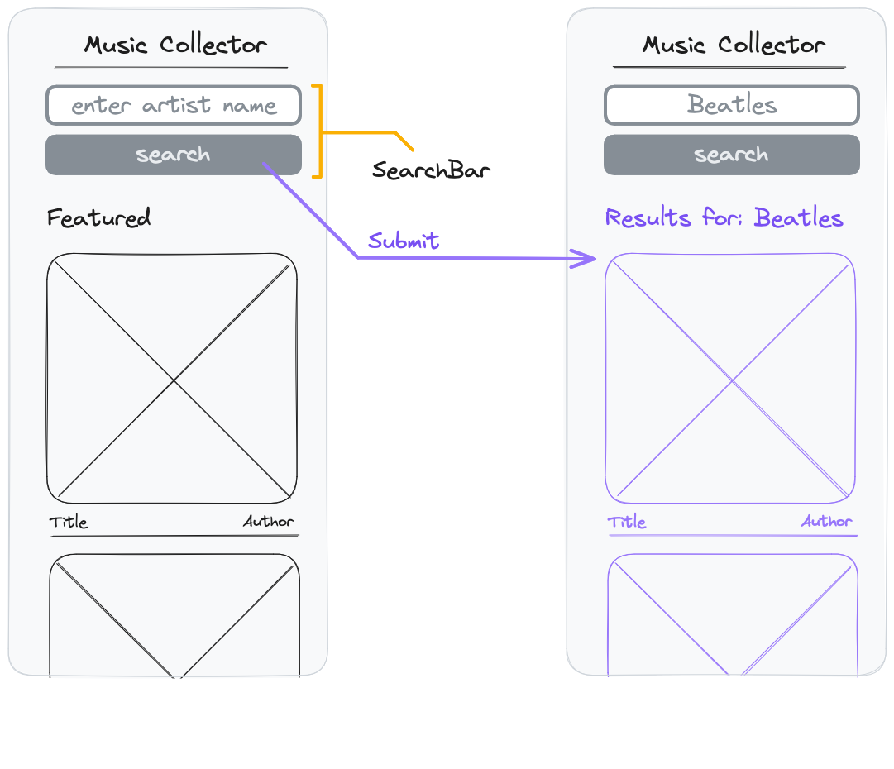

# React Recap Project - Part 4



## Features

Inside the app one can search for albums from specific artists. The results are displayed instead of the "featured" list.

The API endpoint for searches is

```
https://neuefische-spotify-proxy.vercel.app/api/search?artist=<search term>
```

## Acceptance Criteria

- A search bar is displayed above the "featured" album list.
- The search bar is a component called `SearchBar`.
- The search bar contains an input field for the artist name and a submit button.
- When submitting the form,a list of album data related to the search term is fetched and displayed instead of the "featured" list.
- After searching for an artists, the title of the `AlbumList` Component changes to "Results. for: \<search term>".

## Notes

- You can pass a query parameter to the API endpoint by replacing `<search term>` in the url above. Try it in the browser with different search terms and see what data you get back!
- Think about how to toggle between the "featured" list display and the "results" display. How can the app recognize whether a user has submitted a search? How can you change the AlbumList title depending on this?
- You need the search query for the title of your "results" list. How can you store it?
- The solution to this part can now vary quite a bit. The provided solution is only one way of coding the feature.
