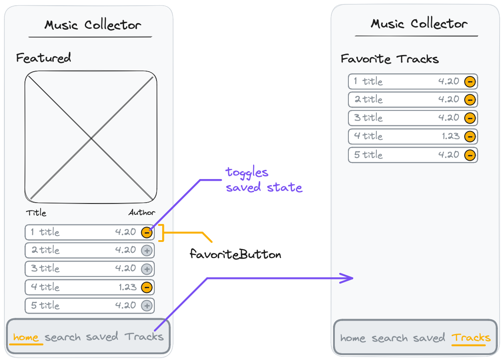

# React Recap Project - Part 9



## Features

Each track inside an album can be added to the favorite song list. A new page lists all saved songs. The save button changes appearance when the song is saved.

## Acceptance Criteria

- A button is rendered next to each track in the `SongList`.
- When the button is pressed on an unsaved track, it is added to the saved tracks.
- When the button is pressed on a saved track, it is removed from the saved tracks.
- In the navigation bar, a fourth element for "Tracks" is displayed.
- Clicking on this element opens the "Favorite Tracks" page.
- The saved tracks are persisted in the localStorage.

## Notes

- This functionality is similar to the saved albums functionality. You need to fetch the tracks from the following API endpoint.
  ```
  https://neuefische-spotify-proxy.vercel.app/api/tracks?ids=<track ids>
  ```
- Think about where in your application you need the new saved tracks state. Where should you define it?
- This is a difficult feature. Good Luck! ✨
