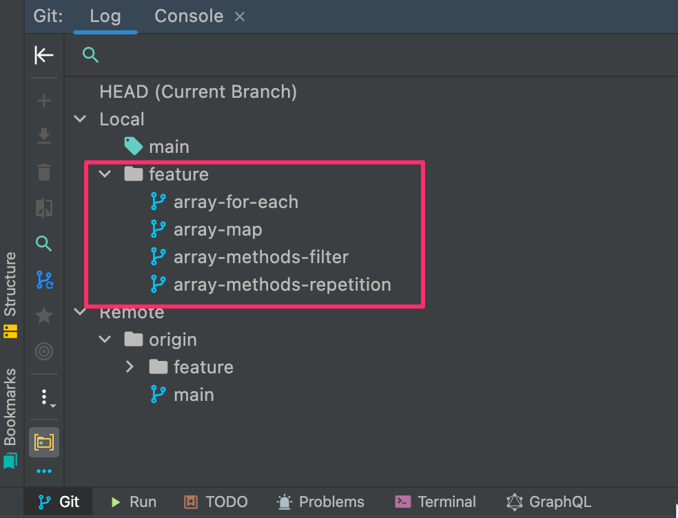

# Branches

1. We use scoped branch names.
2. All branch names are lowercase and hyphenated

> Example: `scoped/lowercase-hyphenated`

## Available Scopes

- feature: `feature/my-feature`
- chore: `chore/achitecture-related`
- bug: `bug/removes-some-poo-poo`
- style: `style/this-needed-formatting`
- refactor: `refactor/changes-code-but-not-meaning`
- docs: `docs/adjusts-documentation-only`

This will allow a cleaner structure in various tools (here Webstorm)

