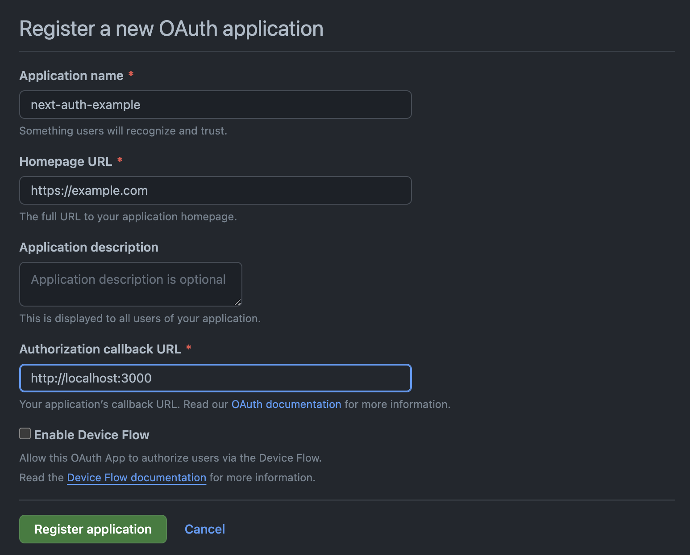
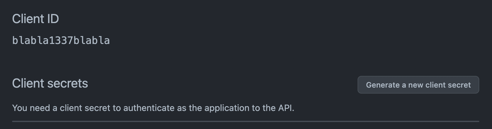
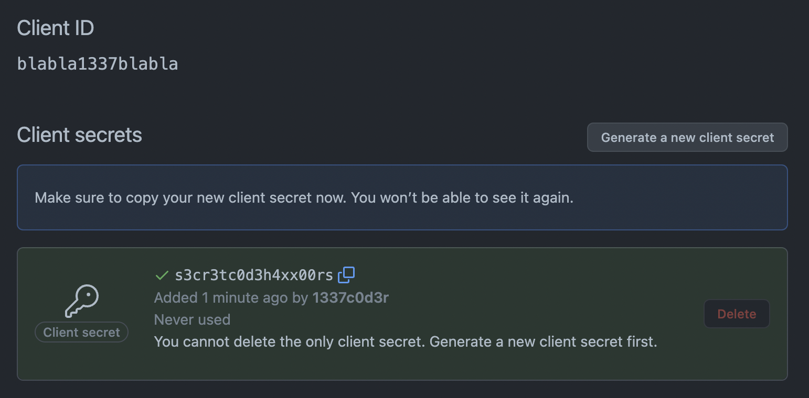

# Next Auth Example

This example shows how to handle **authentication** and **authorization** via the [next-auth](https://next-auth.js.org/) package.

## Github Auth Setup

Register a new [Github App](https://github.com/settings/applications/new) first:



Remember to set http://localhost:3000 as **Authorization callback URL**.

After you register your application, you'll be able to see your `GITHUB_ID` in the **Client ID** section:



Click on the **Generate a new client secret** button to get the corresponding secret code. Note it down, as you won't be able to see it again:



## Setup the local environment

Add the codes above in you `.env.local` file, like:

```
MONGODB_URI='mongodb+srv:...'
GITHUB_ID=blabla1377blabla
GITHUB_SECRET=s3cr3tc0d3h4xx0r5
AUTH_SECRET=s3cr3t
NEXTAUTH_URL=http://localhost:3000
```

## Additional packages

We'll need:

- `next-auth`;
- `@next-auth/mongodb-adapter`.

## Auth configuration

The auth provider needs to query existing users from MongoDB. For some reason, the already existing mongoose connection is not accepted by `@next-auth/mongodb-adapter`, so we need to expose the direct MongoDB connection in `@/db/mongoDb.js` like:

```js
// This approach is taken from https://github.com/vercel/next.js/tree/canary/examples/with-mongodb
import { MongoClient } from 'mongodb';

if (!process.env.MONGODB_URI) {
  throw new Error('Invalid/Missing environment variable: "MONGODB_URI"');
}

const uri = process.env.MONGODB_URI;
const options = {};

let client;
let clientPromise;

if (process.env.NODE_ENV === 'development') {
  // In development mode, use a global variable so that the value
  // is preserved across module reloads caused by HMR (Hot Module Replacement).
  if (!global._mongoClientPromise) {
    client = new MongoClient(uri, options);
    global._mongoClientPromise = client.connect();
  }
  clientPromise = global._mongoClientPromise;
} else {
  // In production mode, it's best to not use a global variable.
  client = new MongoClient(uri, options);
  clientPromise = client.connect();
}

// Export a module-scoped MongoClient promise. By doing this in a
// separate module, the client can be shared across functions.
export default clientPromise;
```

Then we need to configure the following in `@/pages/api/auth/[...nextauth].js`:

```js
import NextAuth from 'next-auth';
import GithubProvider from 'next-auth/providers/github';
import { MongoDBAdapter } from '@next-auth/mongodb-adapter';
import connect from '@/db/mongoDb';

export const authOptions = {
  adapter: MongoDBAdapter(connect),
  secret: process.env.AUTH_SECRET,
  providers: [
    GithubProvider({
      clientId: process.env.GITHUB_ID,
      clientSecret: process.env.GITHUB_SECRET,
      allowDangerousEmailAccountLinking: true,
    }),
  ],
  session: {
    strategy: 'jwt',
  },
  callbacks: {
    session: ({ session, token }) => ({ ...session, id: token.sub }),
  },
};

export default NextAuth(authOptions);
```

## Logging in from the client

In this example, the login button has been embedded in the navigation like:

```js
import Link from 'next/link';
import { useSession, signIn, signOut } from 'next-auth/react';

export default function Nav() {
  const { data: session } = useSession();
  return (
    <nav>
      <Link href="/">Home</Link>
      {!session ? (
        <button onClick={signIn}>Sign in</button>
      ) : (
        <>
          <Link href="/posts/mine">My Posts</Link>
          <Link href="/posts/new">New Post</Link>
          <button onClick={signOut}>Sign Out</button>
        </>
      )}
    </nav>
  );
}
```

- the `session` object contains the info about the current user (in the React client);
- the `signIn` method redirects to the Github login page;
- the `signOut` method clears the session.

## Checking the logged status in the client

In this scenario, we are displaying the edit button just if the author of the post is the logged user (by comparing the respective IDs).

```js
const { data: session } = useSession();

...

<article>
  <header>
    Written by{' '}
    <Image
      src={post.author.image}
      alt={post.author.name}
      width={32}
      height={32}
    />{' '}
    <strong>{post.author.name}</strong>{' '}
    {post.author._id === session?.id && (
      <Link href={`/posts/${id}/edit`}>(Edit)</Link>
    )}
  </header>
```

## Checking the logged status on the server

The `getServerSession` method from `next-auth/next` exposes the session on the server. If there is no session we can cut the thing short and send a [401](https://developer.mozilla.org/en-US/docs/Web/HTTP/Status/401). Otherwise we have the `id` of the logged user in the session, and we can save it as the post author like `await Post.create({ ...request.body, author: session.id })`.

The whole example:

```js
import connect from '@/db/connect.js';
import Post from '@/db/models/Post.js';
import { authOptions } from '../auth/[...nextauth]';
import { getServerSession } from 'next-auth/next';

export default async function handler(request, response) {
  await connect();

  ...

  if (request.method === 'POST') {
    const session = await getServerSession(request, response, authOptions);
    if (!session) {
      response.status(401).json({ message: 'You must be logged in.' });
      return;
    }
    try {
      const post = await Post.create({ ...request.body, author: session.id });
      response.status(201).json(post);
    } catch (error) {
      console.log('POST /api/posts', error);
      response.status(500).json({ message: 'Error creating post' });
    }
    return;
  }

  response.status(405).json({ message: 'Method not allowed' });
}
```

## Interesting endpoints

- `GET /api/users/me` - info about the logged user;
- `GET /api/users/me/posts` - posts whose author is the logged user (will look different, based on who is browsing).