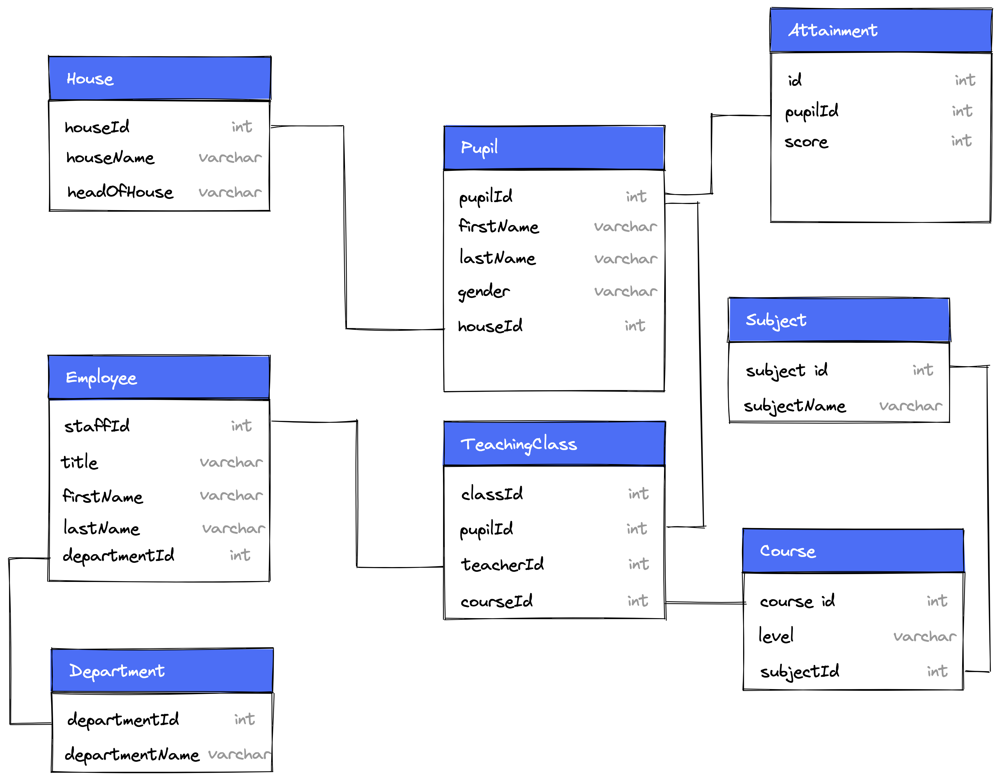

# Backend MongoDB: Database Design

In this challenge, you will draw the data structure of a database for products.

## Tasks

In your browser, open [excalidraw](https://excalidraw.com/).

Create the data structure for a database of products. Draw lines between the datasets to visualize their overlaps.

You can use the following hints as guideline:

- There are four datasets relating to each other: `products`, `category`, `reviews`, and `user`.
- Each `product` contains the following fields:
  - `id`
  - `name`
  - `description`
  - `price`
  - `currency`
  - `categories[]`
  - `reviews[]`
- Each `category` contains the following fields:
  - `id`
  - `name`
- Each `review` contains the following fields:
  - `id`
  - `title`
  - `text`
  - `rating`
  - `user`
- Each `user` contains the following fields:
  - `id`
  - `name`

Look at the following image to grasp an idea how a database design structure might look like:

