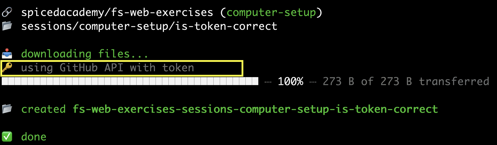

# Computer Setup

We are checking to confirm that your computer setup has been executed correctly.

Upon downloading this folder, if you observe the message `using Github API with token` in your terminal, just as shown in the image below, your computer setup has been executed as intended.

Otherwise, it suggests that you have missed step 8 in the installation guide.
