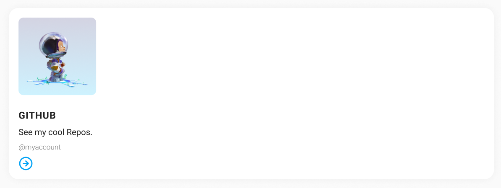

# Social Card

Your task is to recreate the following social card.

- [ ] Link to the `./css/styles.css` style sheet in the head of the `./index.html` file.
- [ ] Style all elements on the page to recreate these social card styles.
- [ ] Use class selectors to target the correct elements.

## Notes

- Don't worry about matching the font. If you really want to use a web font, please refer to the handout.

## Development

### Local Development

Run `npm run start` to start a development server and open [localhost:3000](http://localhost:3000) in a browser.

> Alternatively you can use the Live Preview Extension for Visual Studio Code to view this project.  
> Select the HTML file you want to view, press <kbd>⇧</kbd><kbd>⌘</kbd><kbd>P</kbd>, search for `Live Preview: Show Preview` and confirm with <kbd>Enter</kbd>.

### Scripts

You can use the following commands:

- `npm run start` to start a development server
