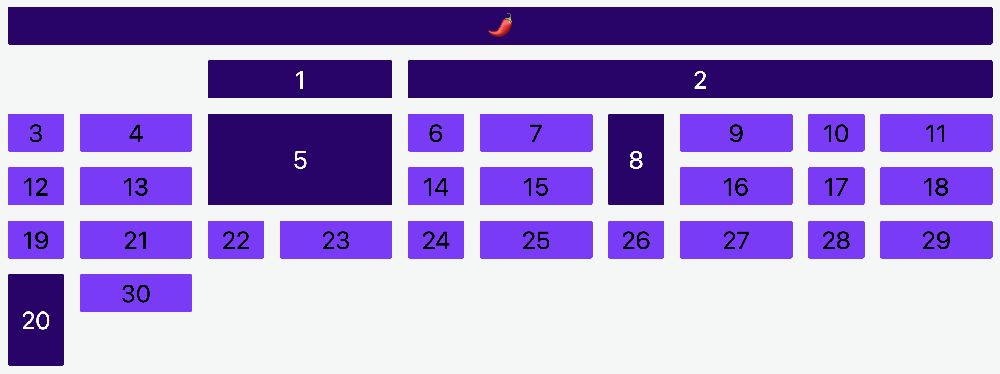

# Place Elements

In this challenge, you will encounter the following tasks:

- placing elements in specific cells
- stretching elements over multiple cells

Please switch to the [`css/styles.css`](./css/styles.css) file to start the challenge. You will find the exact tasks there.

Expected Result:

## Development

### CodeSandbox

Select the "Browser" tab to view this project.

### Local development

Use the Live Preview Extension for Visual Studio Code to view this project in the browser.  
Select the HTML file you want to view, press <kbd>⇧</kbd><kbd>⌘</kbd><kbd>P</kbd>, search for `Live Preview: Show Preview` and confirm with <kbd>Enter</kbd>.
