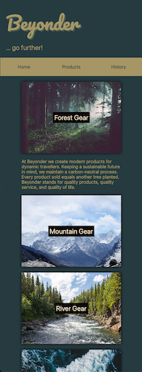
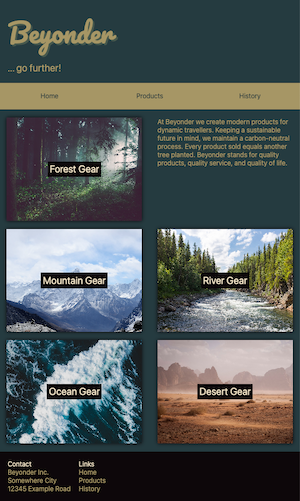
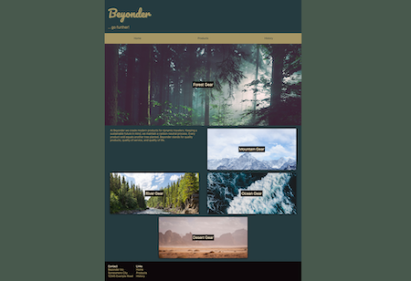

# CSS Responsive: Responsive Website

This challenge focuses on making a website responsive via media queries and breakpoints.

Make sure to take a good look at the preview screens.

## Tasks

- Familiarize yourself with the `./index.html` and `./css/styles.css` files.
- Review the preview screens below to get an idea of the necessary adjustments.
- Determine the number of breakpoints to achieve a responsive layout.
- Identify the changes needed to meet the visual guidelines shown in the preview screens.
- ... enjoy!

### Preview Screens

#### Mobile Screens

 

#### Tablet Screen

#### Desktop Screen

---

## Hint ✨

_Several hints can be found in the `./css/styles.css` file._

## Development

Run `npm run start` to start a development server and open [localhost:3000](http://localhost:3000) in a browser.

> Alternatively you can use the Live Preview Extension for Visual Studio Code to view this project.
> Select the HTML file you want to view, press <kbd>⇧</kbd><kbd>⌘</kbd><kbd>P</kbd>, search for `Live Preview: Show Preview` and confirm with <kbd>Enter</kbd>.

### Scripts

You can use the following command:

- `npm run start` to start a development server
