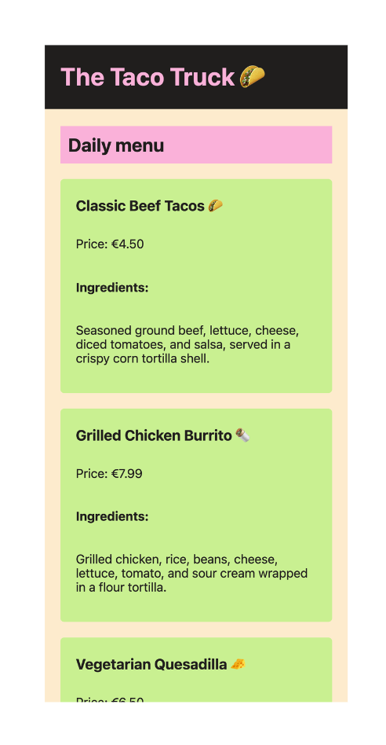
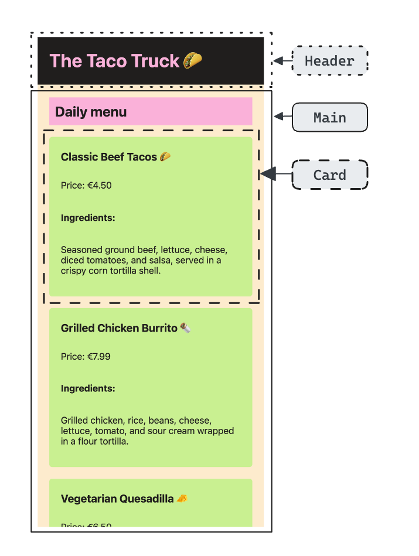

# CSS Structure: The Taco Truck

## Tasks

The owner of The Taco Truck has realized that his website's design needs frequent updates due to changing menu items and offers. To make future updates easier, the CSS needs to be restructured for improved maintainability and readability. Your colleague started this task but is now on holiday, so you'll need to take over.

### Step 1

> Your colleague has left you an `assets` folder containing these two images:

| Wireframe                                  | Components                                          |
| ------------------------------------------ | --------------------------------------------------- |
|  |         |
| This is the overall layout of the website. | These are the components your colleague identified. |

- Review the current state of the `index.html` file.
- Notice that the `styles.css` file is already linked in `index.html`.
- Open `styles.css` and review the existing styles and the import statement included.

### Step 2

- Referring to the "Components" image, observe that three main components have been identified for styling.
- Each component (Header, Main, Card) contains several sub-elements.
- In `index.html`, note how the HTML elements are structured similarly to the components shown in the image.

### Step 3

Now, it's time to refactor the CSS for a more modular and maintainable structure!

- Seperate the CSS into different files by creating a unique CSS file for each component (e.g., `header.css`, `main.css`, `card.css`).
- Create at least 3 new CSS files.
- To ensure your styles load correctly, import the new CSS files into `styles.css` using `@import`.

### Final Step

- When complete, your menu website should look similar to the "Wireframe" image, and you should have at least three component-based CSS files in your `components` folder.

### Bonus Step

- Have fun and be creative! Consider creating new HTML and CSS for additional components.
- Ideas include adding a footer component, button component, or any other component that would enhance the site’s look and functionality.

## Notes

- You only have to work with the following files:
  - `./styles.css`
  - `.theme.css`
  - `index.html`
- You will have to create at least three **new** files!

## Development

Run `npm run start` to start a development server and open [localhost:3000](http://localhost:3000) in a browser.

> Alternatively you can use the Live Preview Extension for Visual Studio Code to view this project.  
> Select the HTML file you want to view, press <kbd>⇧</kbd><kbd>⌘</kbd><kbd>P</kbd>, search for `Live Preview: Show Preview` and confirm with <kbd>Enter</kbd>.

### Scripts

You can use the following command:

- `npm run start` to start a development server
