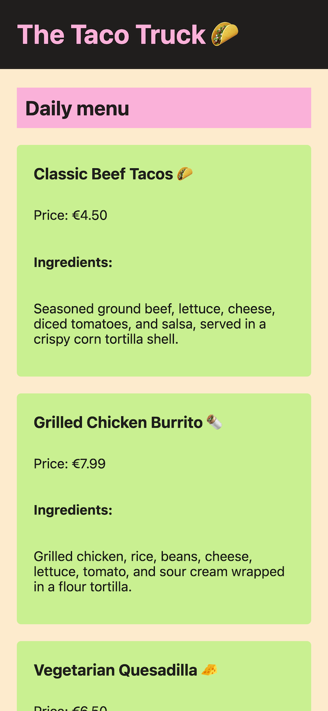
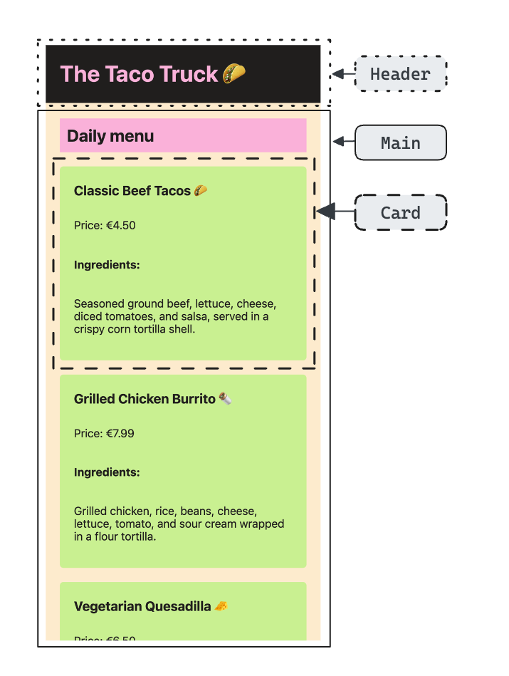

# Taco Truck

## Task

Tommy from Tommy's Taco Truck needs your help! He's asked your colleague to create a menu website for his taco truck, but now your colleague has gone on vacation and Tommy needs his website tomorrow!

### Step 1

> Your colleague has left you an `asset` folder containing these two images:

| Wireframe                                                  | Components                                              |
| ---------------------------------------------------------- | ------------------------------------------------------- |
|                        |                   |
| This is the general look Tommy wants for his menu website. | These are the components your colleague has identified. |

> 🚨 He's let us know that - because we're in such a hurry - we don't need to implement these styles in a pixel-perfect way. **Close enough is good enough!**

- Take a look at the current state of the `index.html`.
- It looks like your colleague has already linked to a `styles.css`.
- Take a look at the `styles.css` file.
- You may notice that there are some styles and one import included here.

### Step 2

- Looking at the "Components" image, your colleague has identified three components that need to be styled.
- Each component (Header, Main, Card) consists of several parts.
- Take a look at the `index.html` and try to find out which HTML elements are already nested ("grouped") in a way that resembles the components in the image.

### Step 3

Now it's time to write some CSS!

- You may want to start off by adding your class selectors to HTML elements.
- You remember that it is good practice to split the CSS into grouped chunks, so you create one CSS file for each component you identified (e.g. `card.css`).
- Create at least 3 CSS files!
- For some reason the styles don't appear on your website. You remember that you need to import your other CSS files in your `styles.css`.
- Now you can style your components by writing the CSS into the respective CSS file.
  💡 Feel free to use the CSS variables defined in the `theme.css` file with `var(--your-variable)` while styling your components.
- Continue styling the website until it looks fabulous ✨.

### Final Step

- Once everthing's in order, you should have a menu website that looks something like the "Wireframe" image, and you should have at least three component-based CSS files sitting in your `components` folder.

### Bonus Step

- Have fun! Try writing entirely new HTML and corresponding CSS to build your own components!
- Maybe Tommy might appreciate a footer component, or a button component, or ... something else entirely?

## Notes

- You only have to work with the following files:
  - `./styles.css`
  - `.theme.css`
  - `index.html`
- You will have to create at least three **new** files!

## Development

Run `npm run start` to start a development server and open [localhost:3000](http://localhost:3000) in a browser.

> Alternatively you can use the Live Preview Extension for Visual Studio Code to view this project.  
> Select the HTML file you want to view, press <kbd>⇧</kbd><kbd>⌘</kbd><kbd>P</kbd>, search for `Live Preview: Show Preview` and confirm with <kbd>Enter</kbd>.

### Scripts

You can use the following commands:

- `npm run start` to start a development server
