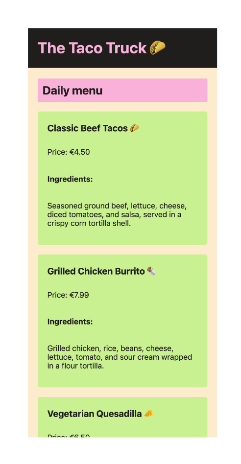

# The Taco Truck

## Task

The owner of The Taco Truck has realized that his website's design needs frequent updates due to changing menu items and offers. To make future updates easier, the CSS needs to be reworked for better maintainability and readability. Your colleague started this task but is now on holiday, and you need to take over.

### Step 1

> Your colleague has left you an `asset` folder containing these two images:

| Wireframe                                                  | Components                                              |
| ---------------------------------------------------------- | ------------------------------------------------------- |
|                        |                   |
| This is the general look of the website. | These are the components your colleague has identified. |

- Review the current state of the `index.html` file.
- Notice that your colleague has already linked a `styles.css` file.
- Take a look at the `styles.css` file.
- Examine the `styles.css` file to see the existing styles and the import statement included.

### Step 2

- Referring to the "Components" image, your colleague has identified three components to be styled.
- Each component (Header, Main, Card) consists of several parts.
- Check the `index.html` to see which HTML elements are nested in a way that resembles the components in the image.

### Step 3

Now it's time to refactor the CSS for better structure and maintainability!

- Split the CSS into grouped chunks by creating a separate CSS file for each component (e.g., `header.css`, `main.css`, `card.css`).
- Create at least 3 CSS files.
- Ensure your styles appear on the website by importing the new CSS files into styles.css using `@import`.

### Final Step

- Once everything is in order, your menu website should resemble the "Wireframe" image, and you should have at least three component-based CSS files in your `components` folder.

### Bonus Step

- Have fun and be creative! Try writing new HTML and corresponding CSS to build additional components.
- Consider adding a footer component, a button component, or any other component you think Tommy might appreciate.

## Notes

- You only have to work with the following files:
  - `./styles.css`
  - `.theme.css`
  - `index.html`
- You will have to create at least three **new** files!

## Development

Run `npm run start` to start a development server and open [localhost:3000](http://localhost:3000) in a browser.

> Alternatively you can use the Live Preview Extension for Visual Studio Code to view this project.  
> Select the HTML file you want to view, press <kbd>⇧</kbd><kbd>⌘</kbd><kbd>P</kbd>, search for `Live Preview: Show Preview` and confirm with <kbd>Enter</kbd>.

### Scripts

You can use the following commands:

- `npm run start` to start a development server
