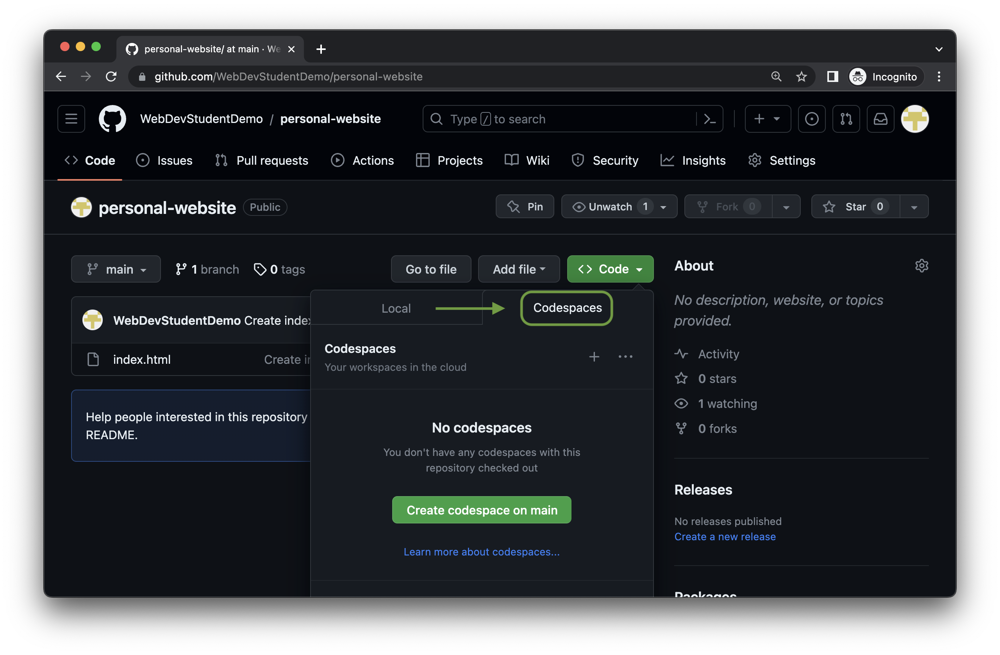

# VS Code in the cloud with GitHub Codespaces

In this challenge you will learn how to use VS Code in the cloud with GitHub Codespaces.

## Getting started with GitHub Codespaces

### Create a new repository on GitHub

- Step 1: Go to the GitHub website.
- Step 2: Sign in to your GitHub account.
- Step 3: Click on the "+" button in the top right corner of the page.
- Step 4: Select "New Repository" from the drop-down menu.
- Step 5: Choose your account as the owner of the repository.
- Step 6: Enter a name for your repository. It should be named "personal-website".
- Step 7: (Optional) Enter a description for your repository.
- Step 8: Choose a repository visibility. You can choose to make your repository public.
- Step 9: It´s not necessary to initialize this repository with a README, gitignore, or license file.
- Step 10: Click on the "Create repository" button.

Your new repository will be created.

That's it! You have now successfully created a new repository on GitHub.

### Create a new file in your repository

When your repository is created, you will see a page on GitHub that looks like this:

- Step 1: Click on the "creating a new file" link.

  This will take you to a page where you can create a new file in your repository.

- Step 2: Enter a file name. It should be named "index.html".

- Step 3: Click on the "Commit changes…" button.

Your new file will be created.

That's it! You have now successfully created a new file in your repository.

### Open a new Codespace

- Step 1: Go to your repository on GitHub.

- Step 2: Click on the "Code" button.

- Step 3: Select the "Codespaces" tab and click on the "Create codespace on main" button.

- Step 4: Wait for your codespace to be created.

### Open and preview the new file in VS Code and the browser

- Step 1: Open the index.html file in VS Code.
- Step 2: Make any changes that you want to the file.
- Step 3: Save the file.
- Step 4: In the VS Code extensions bar, search for "Live Server" and install the extension.

---
- Step 5: Click on the "Go Live" button in the VS Code status bar.
---

Your website will now be opened in a browser preview. Any changes that you make to the index.html file will be automatically reflected in the browser preview.

This is a great way to see how your website will look before you deploy it to a live server.

Step 6: (Optional) If you want to have a browser preview that is embedded in VS Code, you can switch to the "Ports" tab in the VS Code status bar and click on the "Preview in Editor" button located in the "Local Address" column. This will open a browser preview right inside of VS Code.

You have now successfully created a new repository on GitHub, created a codespace, installed the Live Server extension, and previewed your website in a browser.

Congratulations! 🎉

You are now ready to start implementing your website. Just take it one step at a time, and don't be afraid to ask for help if you get stuck.

[Next challenge: HTML and the web: Personal Website](../personal-website/README.md)
