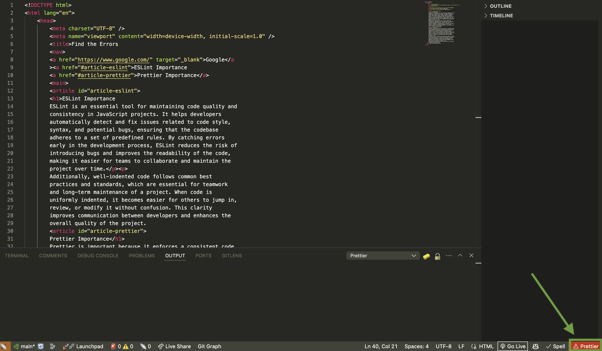
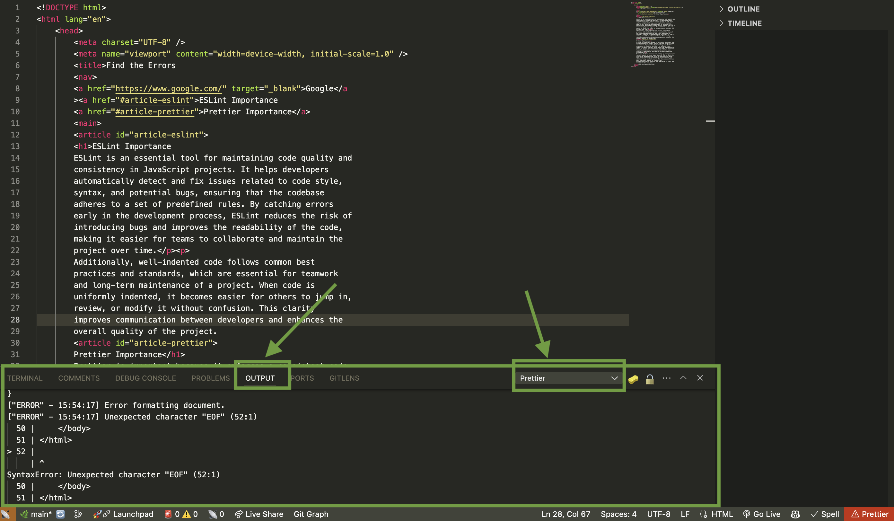

# HTML and the Web: Find the Errors

In this challenge, you will debug HTML code to understand the importance of Prettier and learn how to read error messages.

## Getting Started with HTML

1. Inside this folder, create a file called `index.html`.
2. Inside `index.html`, paste the following code:

   ```html
   <!DOCTYPE html>
   <html lang="en">
      <head>
         <meta charset="UTF-8" />
         <meta name="viewport" content="width=device-width, initial-scale=1.0" />
         <title>Find the Errors
         <header>
         <nav>
         <a href="https://www.google.com/" target="_blank">Google</a
         ><a href="#article-eslint">ESLint Importance
         <a href="#article-prettier">Prettier Importance</a>
         </header>
         <main>
         <h1>ESLint and Prettier</h1>
         <article id="article-eslint">
         <h2>ESLint Importance
         ESLint is an essential tool for maintaining code quality and
         consistency in JavaScript projects. It helps developers
         automatically detect and fix issues related to code style,
         syntax, and potential bugs, ensuring that the codebase
         adheres to a set of predefined rules. By catching errors
         early in the development process, ESLint reduces the risk of
         introducing bugs and improves the readability of the code,
         making it easier for teams to collaborate and maintain the
         project over time.</p><p>
         Additionally, well-indented code follows common best
         practices and standards, which are essential for teamwork
         and long-term maintenance of a project. When code is
         uniformly indented, it becomes easier for others to jump in,
         review, or modify it without confusion. This clarity
         improves communication between developers and enhances the
         overall quality of the project.
         <article id="article-prettier">
         Prettier Importance</h2>
         Prettier is important because it enforces a consistent code
         style throughout a project, making the code easier to read
         and maintain. By automatically formatting code, Prettier
         eliminates the need for developers to manually align,
         indent, or adjust spacing, which saves time and reduces the
         chance of errors. This consistency also makes it easier for
         teams to collaborate, as everyone works with the same
         structure, reducing the back-and-forth about formatting
         preferences.</p>
         Moreover, Prettier enhances code quality by making it easier
         to spot logical errors or bugs. When the code is uniformly
         structured, developers can focus on functionality rather
         than being distracted by formatting inconsistencies. In
         addition, using Prettier ensures that the codebase follows
         best practices, leading to cleaner, more
         professional-looking projects that are easier to scale and
         maintain in the long term.
      <footer>Web Development Bootcamp
      </body>
   </html>
   ```

3. Save the file. Once saved, you will notice that Prettier (in the bottom right of VS Code) is showing as red. This indicates that there are some formatting or syntax errors. Prettier cannot format files that contain syntax errors, so the HTML is not indented as expected.

   

   > **Note**: If Prettier is not red, it may indicate that you haven't configured [Prettier - Code Formatter](https://marketplace.visualstudio.com/items?itemName=esbenp.prettier-vscode) correctly in VS Code. Please refer to the computer setup guide and ensure Prettier is properly configured.

4. Click on the Prettier icon. In the VS Code terminal, go to the "Output" tab and select "Prettier" from the dropdown menu. Here, you will see a list of errors. Read through these errors to identify issues in the code.

   

5. Analyze the error messages. Do they indicate any missing tags? Which tags need to be corrected? Go back to your HTML file and review the tags to ensure they are properly opened and closed.

6. Save the file again and check the Prettier status. Repeat this process until no more errors appear. When all errors are resolved, the Prettier icon should no longer be red, and the file will auto-indent, indicating that the tags are correct and complete.
