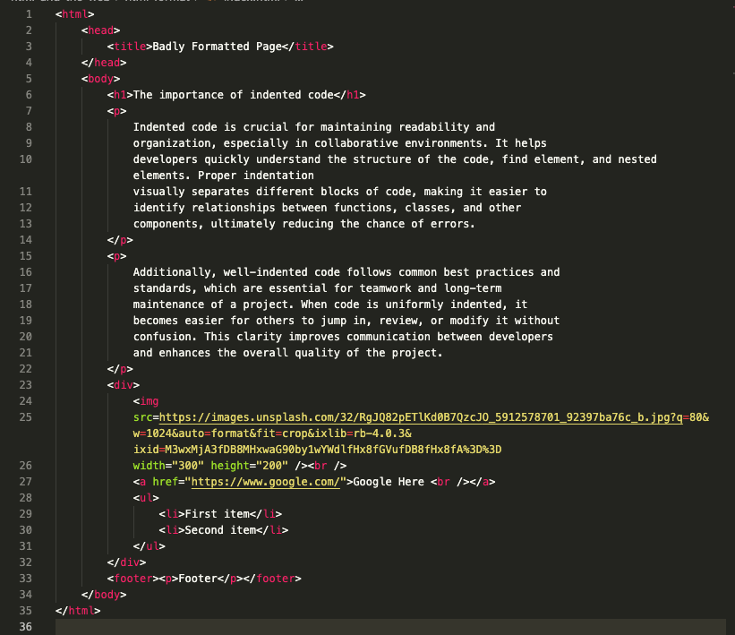

# HTML and the Web: Format Salad

This little challenge checks if you have set up VS Code and Prettier correctly.

## Getting Started with HTML

1. Inside this folder, create the file `index.html`.
2. Inside `index.html`, paste the following code:

   ```html
   <!DOCTYPE html>
   <html>
     <head>
       <title>Badly Formatted Page</title>
     </head>
     <body>
       <h1>The Importance of Indented Code</h1>
       <p>
         Indented code is crucial for maintaining readability and organization,
         especially in collaborative environments. It helps developers quickly
         understand the structure of the code, find elements, and nested
         elements. Proper indentation visually separates different blocks of
         code, making it easier to identify relationships between functions,
         classes, and other components, ultimately reducing the chance of
         errors.
       </p>
       <p>
         Additionally, well-indented code follows common best practices and
         standards, which are essential for teamwork and long-term maintenance
         of a project. When code is uniformly indented, it becomes easier for
         others to jump in, review, or modify it without confusion. This clarity
         improves communication between developers and enhances the overall
         quality of the project.
       </p>
       <div>
         <br /><a href="https://www.google.com/">Google Here <br /></a>
         <ul>
           <li>First item</li>
           <li>Second item</li>
         </ul>
       </div>
       <footer><p>Footer</p></footer>
     </body>
   </html>
   ```

3. Save the file.
4. Once the file is saved, you should see all the code correctly indented.
   

> If your code hasn't been indented after saving, it means that you haven't configured [Prettier - Code Formatter](https://marketplace.visualstudio.com/items?itemName=esbenp.prettier-vscode) correctly in VS Code. Please go back to the computer setup document and reconfigure Prettier.

Congratulations! 🎉 Prettier is correctly set up!
