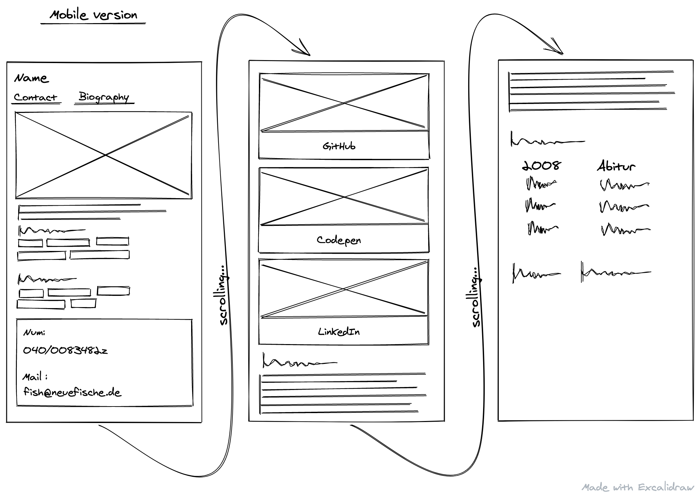
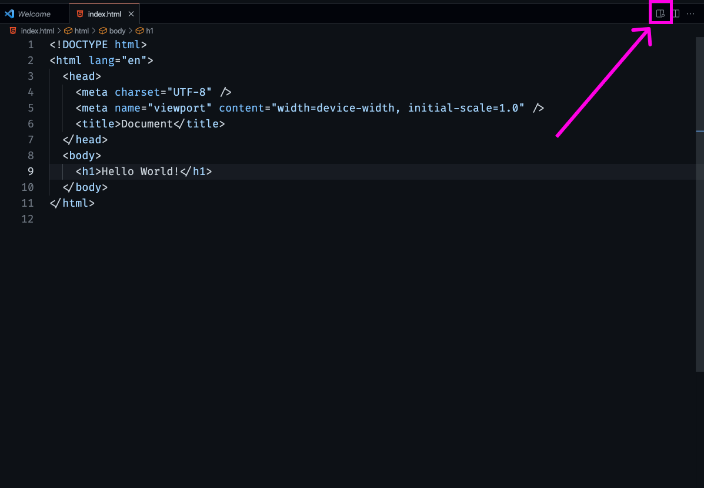
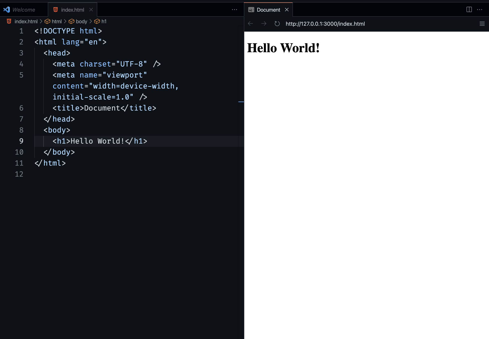

# HTML and the Web: Personal Website

In this challenge, you will start creating your own personal website.

## Getting Started with HTML

1. Begin working on the HTML markup of your personal website inside the `index.html` file.
2. Think about the content you want to include on your website and its structure. You can use
   [Excalidraw](https://excalidraw.com/) to create a draft of your personal website. Don't worry
   about the styling - we will take care of that later. If you need some ideas, refer to the
   wireframe below. Don't spend too long on this task; it's more important to start coding. You
   can always add new features to your draft later.

Here is an example of a structure for a website that you can draw inspiration from:

---

> ❗️ Your personal website won't look exactly like the wireframe for now, as many of the features still
> need to be styled (to align horizontally, for example). We will improve this over the next few days.
> For now, don't focus on the looks, focus on including all relevant HTML elements.

> 💡 You can open the live preview in VS Code to see the website while you are programming!
>  > 

3. Start putting your ideas into code, giving your website structure and content. Use semantic HTML whenever possible.

Congratulations! 🎉 You have created your first website!
