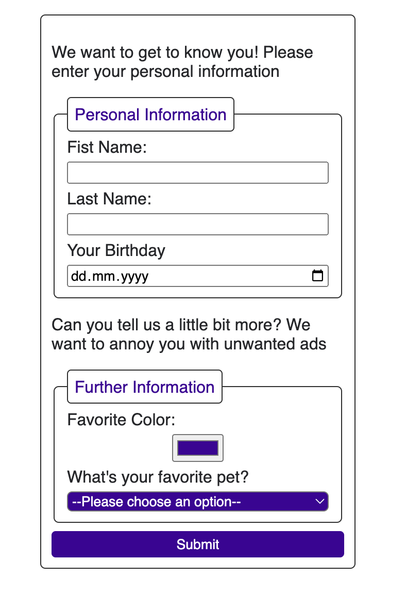

# Personal Profile Form

Let's create our first form!

In the images folder, you find a screenshot how the form should look like:

## Task

Go to [`index.html`](./index.html) file. Inside the section element, build the form as shown in the screenshot.

## Notes

- It should not be necessary to change any styling inside of the [`css/styles.css`](./css/styles.css) file.
- There is no need to write classes here. CSS styling corresponds with the correct HTML elements of the form.
- You might need the input type called "color". Look up how you set the default value for this field to #E5430F.
- Need some hints what to add as an option for favourite pets? Try "Agra cadabra", "Chicken Turtle", or "Fried Egg Jellyfish".

## Development

### Local development

Use the Live Preview Extension for Visual Studio Code to view this project in the browser.  
Select the HTML file you want to view, press <kbd>⇧</kbd><kbd>⌘</kbd><kbd>P</kbd>, search for `Live Preview: Show Preview` and confirm with <kbd>Enter</kbd>.
