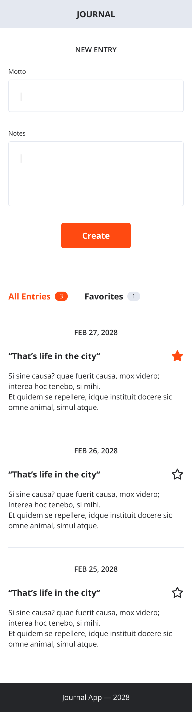

# React Project Setup: Journal App

In this challenge you will begin building a journal app from scratch. We will continue to build on this app throughout the next sessions. In this first part you are about to create the user interface without any interactivity.

## Create the Journal App

Create a new React project called `journal` using Create React App.

> 📙 Read the [Create React App documentation](https://create-react-app.dev/docs/getting-started) to
> learn how to create a new project using `npx`.

## Build the Journal App UI

Check the
[design files for the Journal App](#resources)
and think about the components you will need to create and how they will compose.

<center>

</center>

Here are some hints to get you started:

- The Journal App has a _header_, a _main_ section and a _footer_.
- In the _main_ section, there is an _entry form_ and an _entries section_.
- The _entry form_ has an _input_, a _textarea_ and a submit _button_.
- The _entries section_ has a _tab bar (or tabs)_ and an _entry list_.
- The _tab bar_ has two _tabs_, each with a _badge_ with the number of entries.
- Each _entry_ in the _entry list_ has a title, a date, a text and a favorite _icon button_.

> 💡 Some words are emphasized in the description above. Maybe there is a reason for that? 🤔

### Create the UI

Build the UI of the Journal App using the components you have found. Remember to compose smaller
components together to create bigger ones. Each component should be in its own file.

> ❗️ The app should be completely "dumb" at this point and not have any functionality. The counts
> in the badges should be hardcoded and the entries in the list should be hardcoded as well.
> Submitting the form should not do anything. Clicking the favorite button should not do anything. We will handle this in later sessions.

### Add Styling

Use BEM to name your CSS classes. Colocate your CSS classes with your components using a CSS file
with the same name as the component, that is imported in the component.

```js
// components/EntryForm/index.js
import "./EntryForm.css";
```

## Resources

⬇️ You can [**download the design files and assets for the Journal App here**](./resources.zip?raw=true).

- Unzip the file to get the `resources` folder.
- You can use the `journal_app_design.png` file as a reference for the design.
- If you like you can reference the original Figma design file: `journal_app_design.fig`.
- The `colors.css` file contains the colors used in the design as CSS variables.
- Use the `star.svg` and `star-filled.svg` files for the favorite icon button. Import them in your
  components directly. See the [documentation for adding svgs](https://create-react-app.dev/docs/adding-images-fonts-and-files#adding-svgs).
