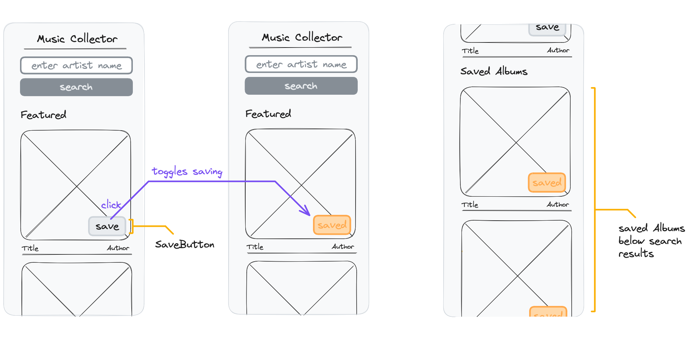

# React Recap Project - Part 5



## Features

In this part, the app is extended about a saving functionality. Each AlbumCard displays a save button which adds or removes the album from a savedAlbums list. A List of the saved albums is displayed below the fetched albums.

A new endpoint for fetching a given list of albums by id must be used in this part:

```
https://neuefische-spotify-proxy.vercel.app/api/albums?ids=<list of album ids>
```

## Acceptance Criteria

- In each AlbumCard, a save button is displayed.
- By clicking on the save button on an unsaved album, the albumId is added to a new state called "savedAlbumIds"
- Saved albums have a differently styled save button to indicate that the album is currently saved.
- By clicking on the save button on a saved album, the albumId is removed from the "savedAlbumIds" state
- Whenever the "savedAlbumIds" array changes, the album data for all saved albums are fetched from the API by using the new API endpoint.
- A list of all saved albums is displayed below the featured / results list. Reuse the component AlbumList here.
- The searched albums and saved albums need to be independent from each other.

## Notes

- Combining data from an api and locally created attributes like the "saved state" of an album is not easy. Please follow the acceptance criteria, they guide you to a working solution.
- The fetched data for the saved albums and the data fetched for the search results must not override each other. Find a way to separate both lists in a meaningful way.
- The savedAlbumIds array is the only data you need to find out if a certain album is saved or not.
- This part is not substantially more challenging than the previous ones. Good luck and don't give up!
