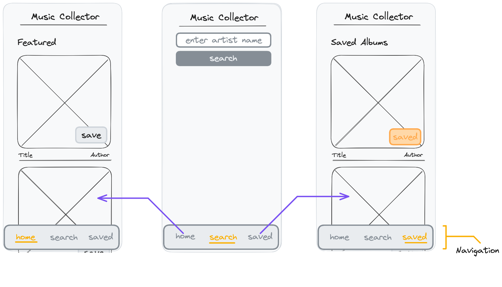

# React Recap Project - Part 7

## Features

The app has already a lot of features. The features are separated into different pages. A navigation bar is displayed which can be used to switch between the pages.

> 💡 The app does not really become a multi page application. The content of the page is replaced when switching to another part of the application. In the future you will learn how to create a real multi page application.

## Acceptance Criteria

- A navigation bar is displayed fixed at the bottom of the screen.
- A Component `Navigation` is created for the navigation bar.
- The navigation bar has 3 elements: "Home", "Search" and "Albums".
- The navigation item of the current page is visually highlighted.
- Pressing the "Home" item displays the "featured" album list in the app.
- Pressing the "Search" item displays the search bar. The results of the search are rendered below the search bar after submitting a search.
- Pressing the "Albums" item displays the saved album list.

## Notes

- Refactor the code from your App.js into 3 components and save them in a new `pages` folder in your `src` folder.
- You will need a new state which tracks which page should be displayed.
- States that are needed in multiple pages should be located in `App.js`.
