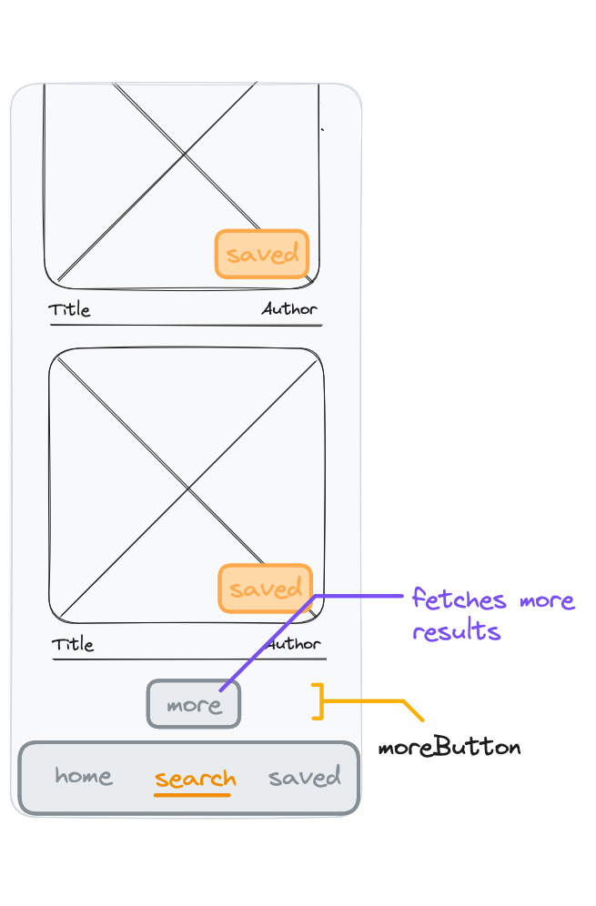

# React Recap Project - Part 8



## Features

When searching for albums, a maximum of 20 entries are displayed in the results. At the end of the list a button is displayed for fetching more results. These results are appended to the list.

## Acceptance Criteria

- A button for fetching more results is displayed at the end of the results list.
- Clicking the button fetches the next results for the query and appends the new albums to the list.
- The button is only displayed on the "search" page after the results are fetched.

## Notes

- The search endpoint of the api can receive an "offset" parameter next to the "artist" parameter for receiving the results starting from this offset value:
  ```
  https://neuefische-spotify-proxy.vercel.app/api/search?artist=test&offset=20
  ```
  This request returns the found entries 20-40 for the artists named "test".
- Make sure that the offset is set to 0 when searching for a new artist.
