# Recap Project I: Quiz App - Layout

In this project you will build the layout of your first mobile web application, a quiz app. In later
projects we will expand this app and add all sorts of cool functionality. In this app you will be
able to:

- Read questions and click buttons to look up the answers.
- Bookmark questions and view them on a bookmarks page.
- Visit your profile page.

❗️ You don't have to worry about how to toggle answers or bookmarks, we will work on that in a
later project. But make sure you include the answer texts and bookmark buttons in your app. (You
might want to look up the "hidden" attribute.)

## 1. Setup

To begin, perform the following tasks:

- Create a new folder for your project.
- Initialize a local git repository.
- Create a `.gitignore` file and add `.DS_Store` to the file.
- Create a remote repository and connect it to the local repository.
- Create the `index.html` and `styles.css` files.
- Ensure that the CSS file is loaded in the HTML document.

## 2. Home Page

As you already know from previous challenges, as developers we want to always finish a feature and
add it to our main branch, instead of starting 3 different features and none of them work. This is
why the first step to success is to start with the homepage.

- Create the following layout:

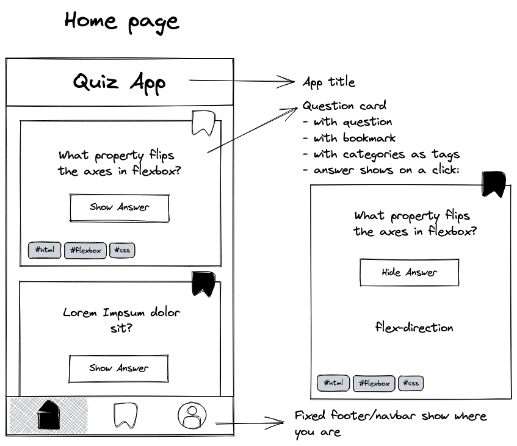

- Start with the feature 'title' on a fresh feature branch and create the app title.

- When done, use the feature branch workflow to merge your results into the main branch.
- Continue in the same way with the 'question-card' and 'navbar'.

> 💡 Hint: Make sure to use anchor elements for the navbar, so you can link to the other pages later
> on!

> 💡 Hint: You can ask fellow students to review your PRs. You will learn and improve a
> lot by doing so.

## 3. Bookmarks Page

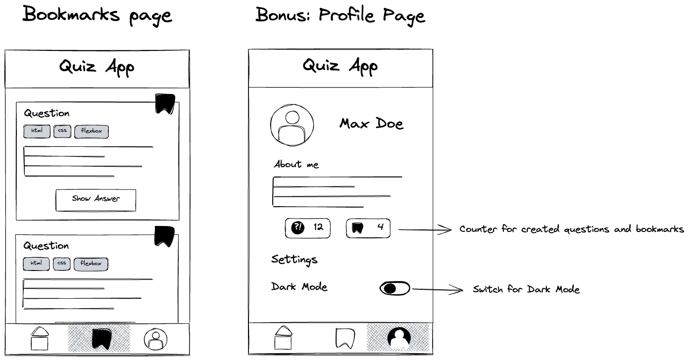

The second page is the bookmarks page.

- Create a new file called 'bookmarks.html'.
- Add content to the page. You can copy content of the `index.html` to save time.
- Make sure that only bookmarked questions are on this page.
- Update the navbar so that the bookmark icon is highlighted.
- Link the two pages via the anchor elements. (Also on the homepage).

## Extra: Profile Page

Create the profile page in the same way you created the other two pages.

- Create a new file `profile.html`.
- Add content to the page.
- Link the pages via the anchor elements.

> 💡 The counter and switch don't have to work for now, we will implement this later.

---

## Extra: Vercel Deployment

You may ask yourself: _"How do I share my Quiz App with others now that I've finished it?"_

Here's one of many solutions! It's fairly easy and there's really not much that can go wrong.

Here is a guide on how to deploy a repository on **Vercel**:

### Deploying a Repository on Vercel

What is **Vercel**? Briefly put, it is a place to host your web applications.

Vercel makes it easy to deploy your projects, whether they are built with React, Next.js, or any other web framework.

Now, following are the steps to deploy a repository on Vercel.

### Vercel Account

If you already have a Github account you need not create a Vercel - in fact, you _shouldn't_. By logging into Vercel with your Github account, the two establish a connection and you've got all of your (public) Github repositories available for deployment.

- [ ] Log in to Vercel with your GitHub account.

| Step     | Screen                            |
| -------- | --------------------------------- |
| Homepage | 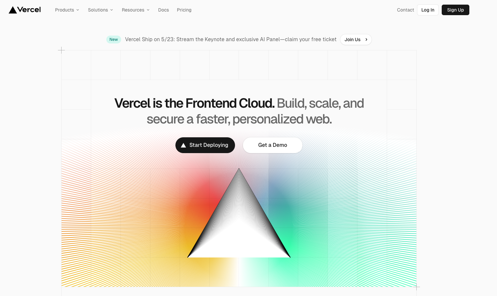 |
| Menu     | 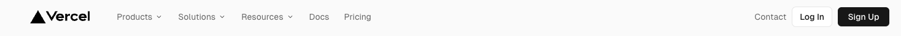     |
| Login    | 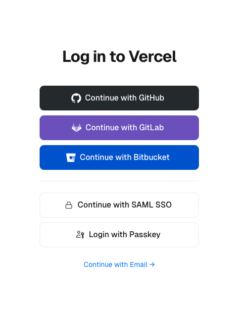    |

### Connect your Git Repository

The next step is to connect your Git repository on GitHub to Vercel. You can do this by clicking the **"Add new ..."** button on the Vercel dashboard, selecting **"project"** and then choosing the repository you want to deploy. The **"Import Git Repository"** menu should already have your GitHub handle pre-selected and you can move on to importing your project of choice.

- [ ] Click on **"Add new ..."**.
- [ ] Click on **"project"**.
- [ ] Select the repository you want to deploy (such as `name-of-your-quiz-app-repo`).

| Step        | Screen                          |
| ----------- | ------------------------------- |
| Add new ... | 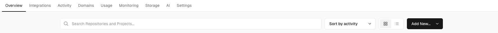    |
| Select      | 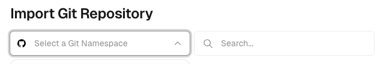 |
| Import      | 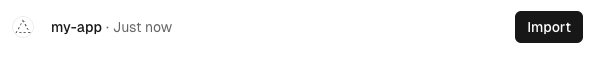 |

### Configure your Project Settings

After selecting your repository, Vercel will detect the framework you are using (e.g. React, Next.js) and pre-configure the build and deployment settings for you. However, you can still customize these settings if needed, such as the build command, output directory, and environment variables.

During **"Recap Project 1"** you can essentially "skip" this step, because you're working with a basic HTML structure that doesn't need any further specifications.

- [ ] Continue with the deployment.

| Step     | Screen                       |
| -------- | ---------------------------- |
| Settings | 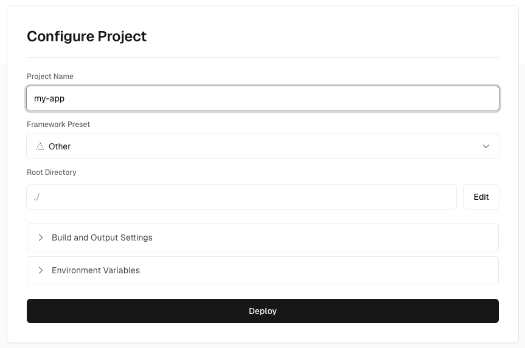 |

### Deploy your Project

Vercel will then build and deploy your project, providing you with a unique URL to preview your deployment.

- [ ] Wait for the build to finish.

| Step     | Screen                       |
| -------- | ---------------------------- |
| Building | 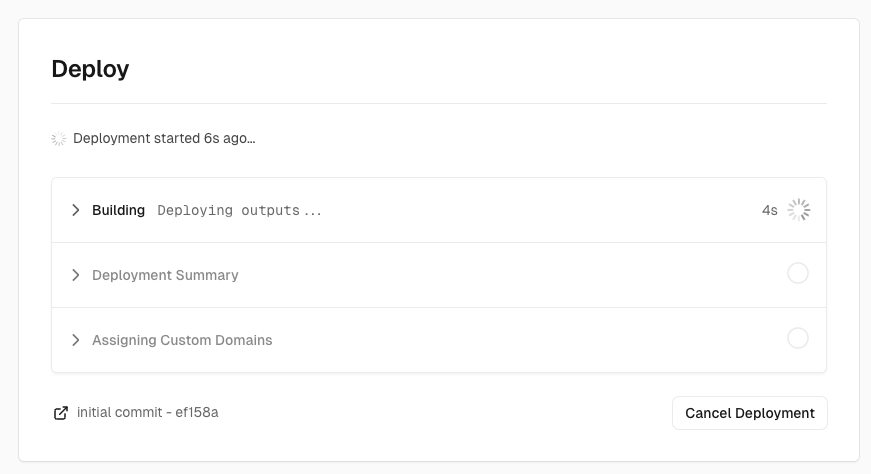 |

### Congratulations!

You have deployed your first repository!

| Step | Screen                       |
| ---- | ---------------------------- |
| Done | 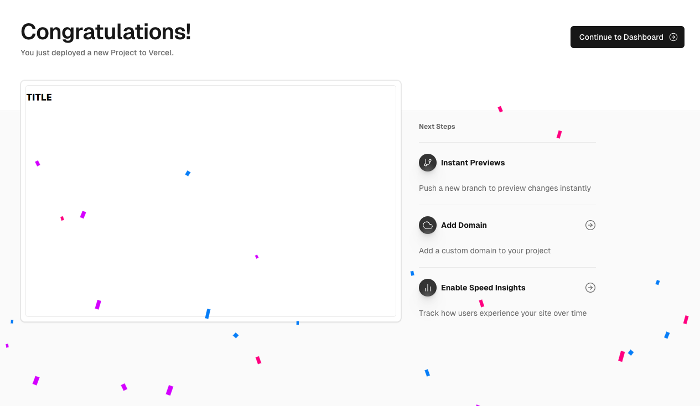 |

### By the way ...

You can now find a link to your deployment on Vercel in the "About" section of the respective repository!

| Step          | Screen                        |
| ------------- | ----------------------------- |
| About Section | 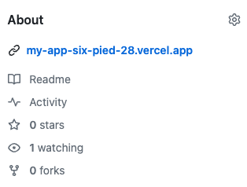 |

### Deployment Protection

> ⚠️ It may be that you find your Vercel deployment to have its "Deployment Protection" turned on by default. You can turn that off by
>
> - navigating to the "Settings" tab of your project on Vercel,
> - selecting "Deployment Protection" and
> - clicking on the "Vercel Authentication" toggle.
>
> This can **only** be accomplished **after** the project has already been deployed.
>
> | Step     | Screen                        |
> | -------- | ----------------------------- |
> | Settings | 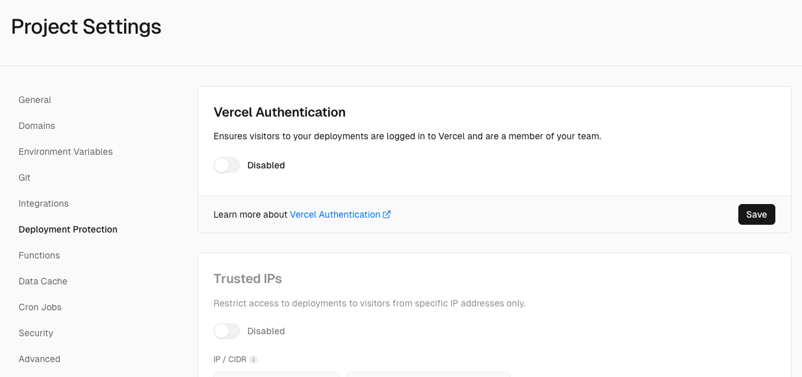 |
