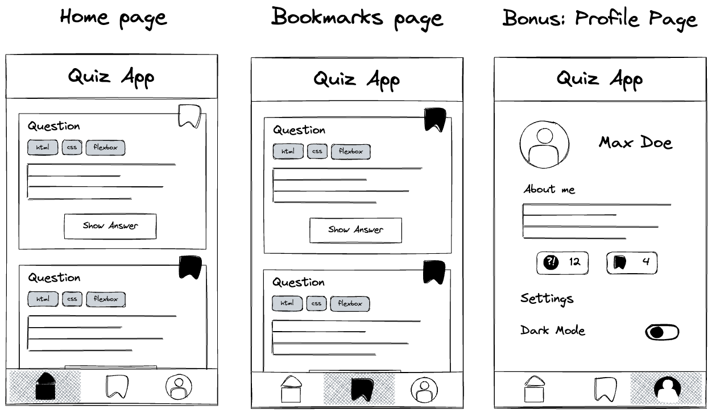
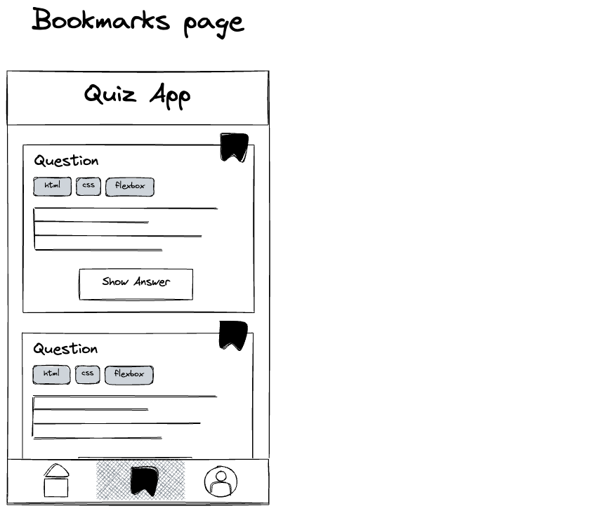
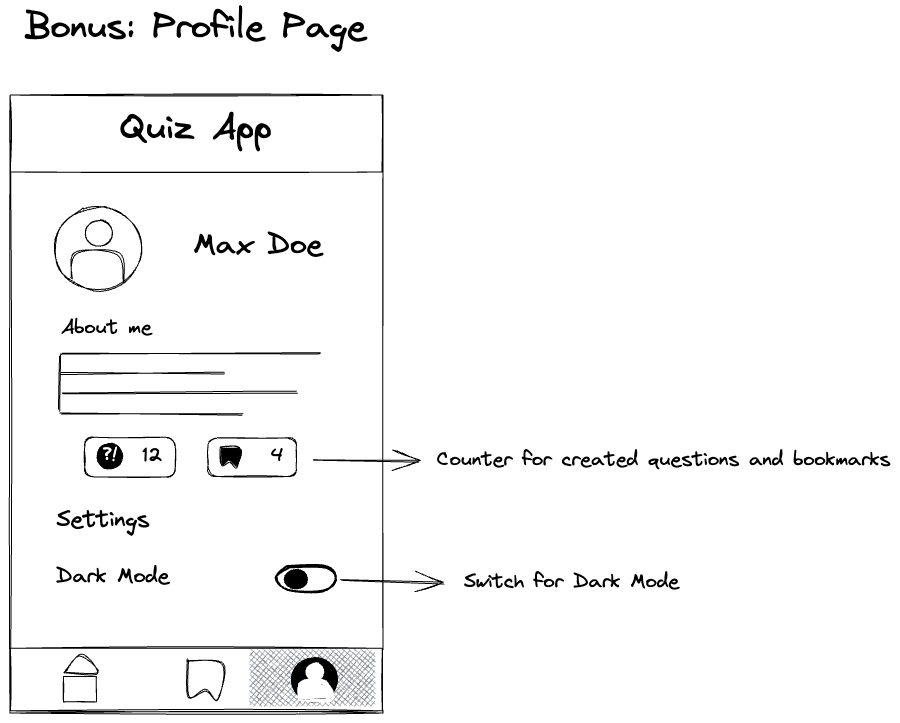

# Recap Project 1: Quiz App - Layout

In this project you will build the layout of your first mobile web application, a quiz app. In later
projects we will expand this app and add all sorts of cool functionality.

## Overview

In this project we will have 3 pages:

- **Home page:** Here, you’ll have access to view all questions available on the platform.
- **Bookmark page:** This is a dedicated space where you can exclusively view the questions you’ve bookmarked, similar to the ones marked on the home page.
- **Profile page:** This section allows you to view and manage your profile and settings.

Explore [these topic](./assets/topics.md) ideas for your quiz app or choose your own, avoiding placeholder text.



## Setup

To begin, perform the following tasks:

- Create a new folder for your project insinde `web-bootcamp`.
- Initialize a local git repository.
- Create a `.gitignore` file and add `.DS_Store` and `.vscode` to the file.
- Create a remote repository and connect it to the local repository.
- Create the `index.html` and `styles.css` files.
- Ensure that the CSS file is loaded in the HTML document.

## Resources

Download the required [Icons](https://lucide.dev/icons/) and save them in an "assets" folder within your app's main directory.

## Deploying Your Project

🚀 Project Deployment to GitHub Pages is required: Please adhere to the deployment guidelines outlined in your [repository's documentation](https://github.com/neuefische/web-protocol-template/blob/main/docs/deployment-github-pages.md) for detailed instructions.

## Tasks

### 1. Home Page

As you already know from previous challenges, as developers we want to always finish a feature and
add it to our main branch, instead of starting 3 different features and none of them work. This is
why the first step to success is to start with the homepage.

- Create the following layout:


- Start with the feature 'title' on a fresh feature branch and create the app title.

- When done, use the feature branch workflow to merge your results into the main branch.
- Continue in the same way with the 'question-card' and 'navbar'.

> 💡 Hint: Make sure to use anchor elements for the navbar, so you can link to the other pages later
> on!

> 💡 Hint: You can ask fellow students to review your PRs. You will learn and improve a
> lot by doing so.

❗️ You don't have to worry about how to toggle answers or bookmarks, we will work on that in a
later project. But make sure you include the answer texts and bookmark buttons in your app. (You
might want to look up the "hidden" attribute.)

### 2. Bookmarks Page



The second page is the bookmarks page.

- Create a new file called 'bookmarks.html'.
- Add content to the page. You can copy content of the `index.html` to save time.
- Make sure that only bookmarked questions are on this page.
- Update the navbar so that the bookmark icon is highlighted.
- Link the two pages via the anchor elements. (Also on the homepage).

## Bonus: Profile Page



Create the profile page in the same way you created the other two pages.

- Create a new file `profile.html`.
- Add content to the page.
- Link the pages via the anchor elements.

> 💡 The counter and switch don't have to work for now, we will implement this later.

## Recommendation

### Separate the Quiz App CSS code into different files

The file name should match the name of the
component.

Move all styles that are used across multiple components to a `global.css` file. Your main CSS file (e.g. `styles.css`) should have several `@import` statements.

The file structure might look something like this:

```
quiz-app
├── components
│   ├── button.css
│   ├── card.css
│   ├── header.css
│   └── navigation.css
├── global.css
├── styles.css
├── profile.html
├── bookmarks.html
└── index.html
```

❗️ Make sure you apply the BEM method to your Quiz App (bring more structure to your code by using BEM to name all classes!).
