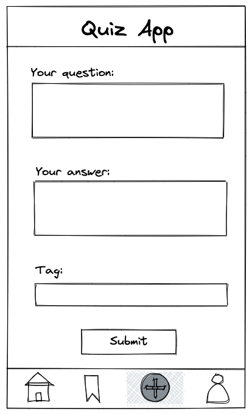
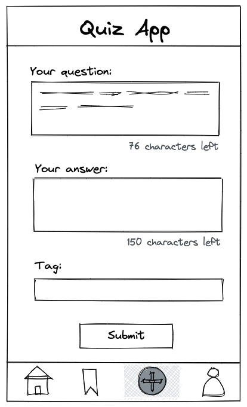

# Recap Project 2: Quiz App - Interactivity

In a previous project, you've created the layout for a Quiz App with HTML and CSS. The focus of this
project is to add interactivity with JavaScript.

## Template

If you are not yet finished or not satisfied with your code from Recap Project 1, you can use this template to start your
work.

Open your terminal and navigate to the folder where all your projects are located. Execute the following
command to create a new project based on a template:

`npx ghcd@latest neuefische/web-exercises/tree/main/sessions/recap-project-2/quiz-app -i`

- There are three pages:
  - an `index.html` with a list of all question cards
  - a `bookmark.html` with bookmarked cards only
  - a `profile.html` with personal information and settings
- The structure of styling follows [BEM](http://getbem.com/introduction/); this is why the CSS files
  are organized according to their corresponding component.

Alternatively you can keep working with the Quiz App you built in Recap Project 1.

## Tasks

### 1. Toggle functionality

You have successfully built your **card** component in your Quiz App. But currently the user
**can't** interact with it. Now we want to implement a toggle functionality for the bookmark and the
answer button.

> ❗️ All functionality applies to the first card and the first bookmark only. Applying the
> functionality to all cards and bookmarks will be discussed later in the bootcamp.

#### Bookmark button

The following acceptance criteria should be met for the bookmark button:

- When the user clicks the **bookmark icon** the **bookmark icon** should change it's visual state
  (e. g. another color or image)
- When the user clicks the **bookmark icon** again the **bookmark icon** should change to its former
  style
- The user can click on the bookmark endlessly and the bookmark will **toggle between both
  stylings**

> **Note:** Clicking on a bookmark icon will not yet cause the question to be displayed on the
> **favorites** page as well and this is **not** part of the exercise.

#### Answer button

The following acceptance criteria should be met for the answer button:

- When the user clicks on the **button** the **previously hidden** answer should be displayed
- When the user clicks this **button** again the answer is **hidden** again
- The user can click on this button endlessly and the answer will **either be displayed or hidden**
  after each click
- The **toggle** functionality should be applied by using a **class** which is named **"hidden"**
- If the user clicks on an answer button, we want the button to say **"hide answer"** when the
  answer is displayed and **"show answer"** when the answer is not displayed.

### 2. Form to add new cards

Users should be able to add new cards to your Quiz App. The first step is to add a page with a form.

- Create a new HTML document called `form.html`
- Add the page to the navigation of your Quiz App
- Within `form.html` create a form with the following fields
  - "Your question" as `<textarea />`
  - "Your answer" as `<textarea />`
  - "Tag" as `<input type="text" />`
  - Submit button

> ❗️ Please consider only a single tag per card for now. Handling a list of individual tags will be
> discussed later on.

### 3. Create new Cards

The data entered into the form by users should be used to create a new question, that will be
displayed as a **card** like the other questions.

- Listen the form's `submit` event
- Prevent the default submit behavior to handle everything within JavaScript
- Read all entered data from the input fields (question, answer, tags)
- Generate all DOM element for a **card** with `createElement()`
- Insert the form's data as text into the DOM elements
- Append the **card** to the page, directly below the form

> ❗️ For now the new **card** should be displayed directly below the form. Adding the **card** to
> the list of the other cards is a topic for later.

> **Note:** To avoid error messages, we recommend creating a new JavaScript file specifically for your form page. This ensures that any event listeners you've added for other pages won't cause problems with HTML elements that aren't present on the form page.

### 4. Form field text counter

The form fields for question and answer should be limited to a text of 150 characters. While typing
users should be informed about the amount of characters left.

- Add a `maxlength` attribute to the form fields
- Add a display below the form fields to show the amount of characters
- Use the `input` event to read the `length` of a field's content and calculate and display the
  result
- Think of ways to use the same logic for both form fields and to not repeat your code

You can have a look at
[this counter example](https://codesandbox.io/s/github/neuefische/web-exercises/tree/main/sessions/recap-project-2/character-count-example)
for inspiration.

## Development

### Local Development

To work locally, please install the dependencies using `npm i` first.

Run `npm run start` to start a development server and open [localhost:3000](http://localhost:3000) in a browser.

> Alternatively you can use the Live Preview Extension for Visual Studio Code to view this project.  
> Select the HTML file you want to view, press <kbd>⇧</kbd><kbd>⌘</kbd><kbd>P</kbd>, search for `Live Preview: Show Preview` and confirm with <kbd>Enter</kbd>.

Use `npm run test` to run the tests.

### CodeSandbox Cloud

Select the "Preview: 3000" tab to view this project.

Select the "Tests: logs" tab to view the tests.

> The `npm run start` and `npm run test` scripts run automatically.

### Scripts

You can use the following commands:

- `npm run start` to start a development server
- `npm run test` to run the tests
- `npm run lint` to run the linter
