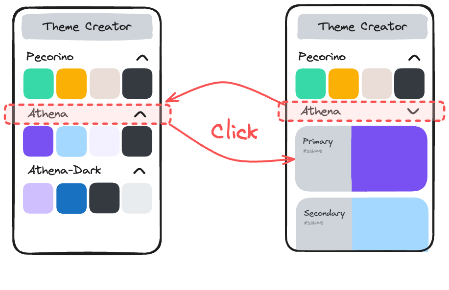

# Part 2: Theme List and Display Toggle

## Value Proposition

**As a** User

**I want to** see a list of themes and toggle between preview and detail view for themes

**in order to** quickly compare different themes and understand their color schemes in detail.

## Description

## Acceptance Criteria

- When I open the app, I can see a list of themes displayed.
- Each theme display can be toggled between preview and detail view.
- In the preview view, the name of the theme is displayed with a small color field for each color.
- In the detail view, the full details of the theme are displayed, as described in the first user story.

## Tasks

- Create separate React components for preview and detail view of themes.
- Create a React component called `Theme`.
- Inside the `Theme` component, implement a toggle functionality between preview and detail view for themes.
- Iterate over the list of given color themes and create a `Theme` component for each.
- Ensure that toggling between views updates the display accordingly.
- Test toggling functionality with different themes to ensure it works as expected.

## Notes

- There are many sources for icons, one recommendation is [tabler icons](https://tabler.io/docs/icons/react).
