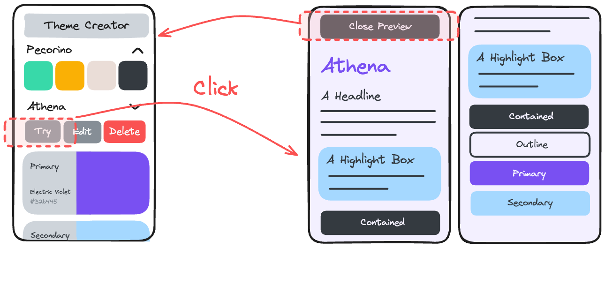

# Part 7: Test Page

## Value Proposition

**As a** User  
**I want to** preview how my theme colors look on UI elements  
**in order to** assess the visual impact of the theme in real-time.

## Description



## Acceptance Criteria

- In the detail view of a theme, there is a "Try Out" button displayed.
- Clicking on the "Try Out" button opens a test page with UI elements styled using the theme colors.
- The UI elements include:
  - a title
  - paragraphs
  - a highlight paragraph with different colors
  - 4 buttons in different
- On top of the test page, a "close preview" button is displayed.
- Clicking this button closes the test page and displays the main page.

## Tasks

- Create a "Try Out" button in the theme detail view.
- Implement functionality to open a the test page on clicking the "Try Out" button.
- Style UI elements on the theme test page using the colors from the selected theme.
- Ensure that UI elements accurately reflect the theme colors.
- Implement functionality to close the test page on clicking the "close preview" button.

## Notes

- You can switch between the test page and main page with a state similar you used inside the `Theme` component for switching between preview, details view and edit view.
- You can pass js variables into your css by defining css variables on your test page container element:
  ```jsx
  const primaryColor = '#123456'
  ...
  return <Container style={{"--primary": primaryColor}} >
    ...
  ```
  You can use `--primary` as a normal css variable in your css.
