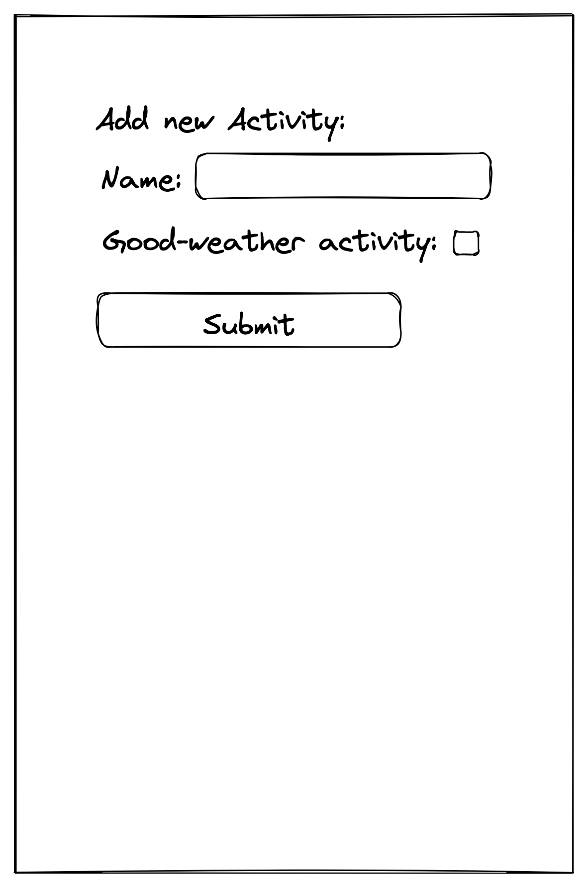
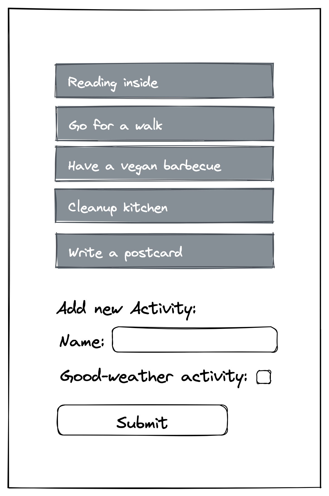
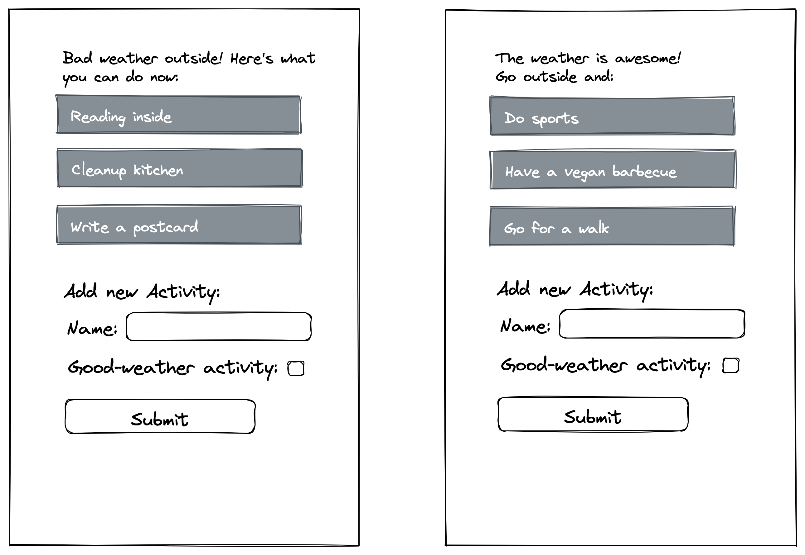
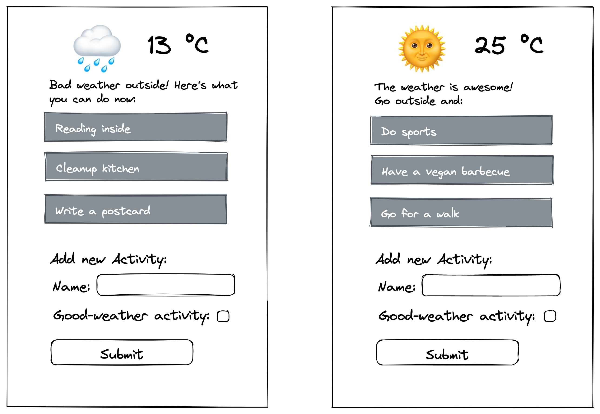
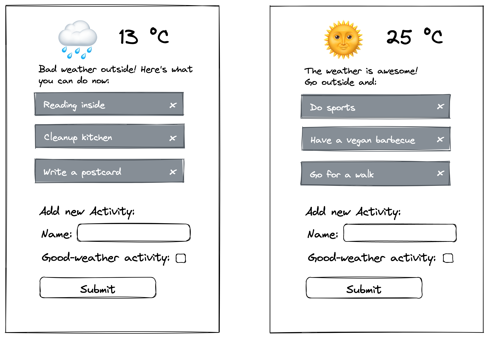

# Recap Project 4: Weather & Activities App

In this recap project, you'll work together with a partner: you'll create an app that fetches a
weather object from an API and conditionally picks activities from a list to display as suggestions.
You'll need to implement a feature that allows you to add more suggestions to the list of activities
and also allows you to delete suggestions.

The way this app is going to handle data is a basic example of CRUD operations. CRUD stands for
Create, Read, Update, and Delete. These operations are the main features every app needs.

Please note: the focus of this challenge is on React logic (and not on design), which is why the
wireframes only have a very basic styling. Due to the given timeframe, you can consider styling the
app as bonus task at the very end ;).

## Pair Programming

Built this project together with a partner in pair programming:

- share a single workstation (one screen, keyboard, and mouse);
- one partner is the "driver" and writes the code;
- the other is called "navigator" and focusses more on the overall direction of the application;
- set a timer (30 minutes is a good amount of time) and change roles regularly.

## API

We are going to fetch all necessary information about the weather from a REST API specifically
designed for this project. Check out the [Weather API](https://example-apis.vercel.app/). You find
all the information you need in the docs.

## Project Scaffolding with `Create React App`

Project scaffolding is the process of creating a new project. You will use the
[Create React App](https://create-react-app.dev/docs/getting-started) tool to create a new React
project automatically.

To create a new project, run the following command in your terminal:

```bash
npx create-react-app recap-project-4
```

This will create a new folder called `recap-project-4` and install all the dependencies needed to run your project. Installing all the dependencies might take a while, so be patient.

> 💡 `npx` is a tool that comes with npm. It allows you to run npm packages without installing them.

> 💡 `create-react-app` is a npm package that is installed globally on your computer. It is a tool that helps you create new React projects.

As a second step, you need to change into the newly created folder and start the development server:

```bash
cd recap-project-4
npm run start
```

This will start a development server that will automatically reload your application whenever you
make changes to your code.

> 💡 You can stop the development server by pressing `Ctrl + C` in your terminal.

> 💡 You can also run `npm start` to start the development server.

Finally, you can open your project in your browser by navigating to `http://localhost:3000`.

The directory structure will look like this:

```
recap-project-4
├── node_modules
├── public
│   ├── favicon.ico
│   ├── index.html
│   ├── logo192.png (this is the React logo)
│   ├── logo512.png (this is the React logo)
│   ├── manifest.json
│   └── robots.txt
├── src (this is where you will write your code)
│   ├── App.css
│   ├── App.js (this is the main component of your app)
│   ├── App.test.js (this is a test file which you can delete)
│   ├── index.css
│   ├── index.js
│   ├── logo.svg (this is the React logo which you can delete)
│   ├── reportWebVitals.js (another file you can delete)
│   └── setupTests.js.js (another file you can delete)
├── .gitignore
├── package-lock.json (this file contains information about the dependencies of your project and should not be changed manually, you can also commit it to git)
├── package.json (Here you can find all the dependencies of your project)
└── README.md
```

> 💡 You can delete all the files in the `public` folder except for `index.html` and `favicon.ico`.

> 💡 Ensure to adjust the import statements in `index.js` and `App.js` accordingly.

> 💡 Collaborators who clone the project from GitHub will need to run `npm install` to install all dependencies.

The sequence of the tasks described below is a good example for how to _start_ writing an app.

> 💡 Because we need data to work with, we usually want to start with the C in CRUD. In this
> instance, adding a form that handles creating the data for our activities.

## Tasks

### Add Activity Form

Being able to create new data is a good starting point for an app, so the first step is to create a
form component to add a new activity.

- Clean the app from everything which you don't need for a fresh start.
- Write a `Form` component which
  - contains a heading
  - has two input fields (name of activity, checkbox whether it is a good- or bad-weather activity)
    with appropriate labels and
  - a submit button;
  - it receives a prop called `onAddActivity`.
- Handle the submit event:

  - Extract the submitted data as an object with the keys `name` and `isForGoodWeather` and their
    respective values.

    - Hint: To get the boolean value of a checkbox, use `.checked`.

  - Call `onAddActivity` and pass it the data object as argument.

- After submitting, reset the form and focus the first input field.
- Switch to the App.js and
  - create a state for `activities`,
  - write a function `handleAddActivity` which accepts a new activity object as parameter and adds
    this object to the `activities` state
  - please add a unique id to every new activity object; you can use
    [uid](https://www.npmjs.com/package/uid) to do so.
- Pass `handleAddActivity` to the Form component; make sure to use the correct prop name.

Use this wireframe as a reference:



🎉 Congratulations, you can now add new activities, including whether they can be done in good or
bad weather!

### List Component

By now, you can add new activities, but they are not yet displayed. Let's fix this.

- Write a `List` component which renders a list with list items for each activity in the
  `activities` state.
- Make the state persistent in local storage.

Use this wireframe as a reference:



### Filtering the List

Currently, the list displays all activities, regardless of whether they are good or bad weather
activities. The main purpose of the app, however, is to show activities depending on the current
(good / bad) weather fetched from an API, so the list needs to be filtered.

- In the App.js, add a variable `const isGoodWeather = true`.
  - Note: For reasons of simplicity (i.e. it will be replaced in the next task anyway), we will use
    a hard coded variable to imitate good or bad weather for now.
- Filter the `activities` for those whose key `isForGoodWeather` is equal to the global
  `isGoodWeather` variable.
- Instead of all `activities`, pass the filtered activities to the `List` component.
- In the List component, add a headline depending on the global `isGoodWeather` variable.

Use this wireframe as reference:



### Fetch API

Refactor the code so that the "random" weather does not depend on a variable you set yourself, but
on the answer from our weather API.

- Replace the global `isGoodWeather` variable from the previous task with a new state for `weather`.
- Fetch the [weather API](https://example-apis.vercel.app/) on initial render only.
  - The `weather` state should equal the response you receive from the API.
  - Advanced note: The API has some more specific endpoints to test your application.
- In the App.js, add a heading to display the condition emoji and the temperature.

Use this wireframe as reference:



### Delete an Item

- In the List component, add a delete button for each list item.
- The List component needs to receive a new prop called `onDeleteActivity`;
  - pass it to the delete button as onClick prop;
  - pass the activity's id to `onDeleteActivity` as argument.
- In the App.js, write a function `handleDeleteActivity`, which accepts an id as parameter. The
  function should filter the `activities` state and keep all objects except the one with the given
  id.
  - Pass `handleDeleteActivity` to the List component as `onDeleteActivity` prop.

Use this wireframe as reference:



### Bonus: Fetch on Intervall

Fetching weather only on initial render is not really useful to stay up-to-date. Refactor your code
so that the fetch is done every 5 seconds. Make sure to clear the timer when the component unmounts.
