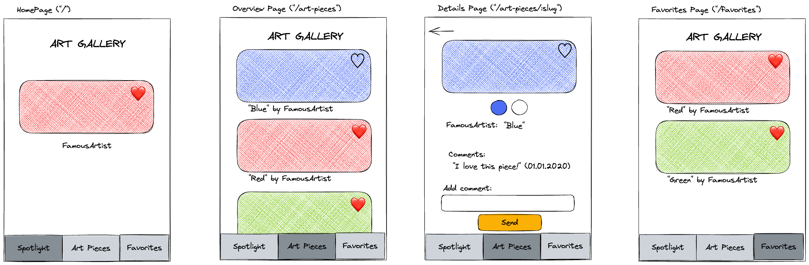

# Recap Project 5: Art Gallery

In this project, your team will create an interactive art gallery app.

This is a group project, so please create **only one project per group** following the [guide in the template section](./README.md#template).

## Overview

In this project, we will create an art gallery app with four pages: **Spotlight**, **Gallery**, **Favorite**, and **Detail**. Users can like or unlike art pieces, and liked pieces will appear on the **Favorite** page.



## API

We will fetch all necessary information about the art pieces from an API specifically designed for this course. [Check out the API](https://example-apis.vercel.app/api/art).

```bash
https://example-apis.vercel.app/api/art
```

## Template

1. Open your terminal and navigate to the folder where your projects are stored.
2. Execute the following command to create a new project based on a template:

   ```bash
   npx ghcd@latest neuefische/web-exercises/tree/main/templates/next art-gallery-app -i
   ```

3. Create a new empty repository on GitHub and add all group members as collaborators.
4. Link your local repository to the GitHub repository and push the code.
5. Each group member clones the repository to their local machine.
6. Follow the instructions in the `README.md` file.

> 💡 **Reminder**: Work on feature branches to avoid merge conflicts!

## Resources

Download a [Favorite Icon](https://lucide.dev/icons/) and save it in an "assets" folder within your app's main directory.

## Deploying Your Project

🚀 Project Deployment to Vercel is required: Please follow [these instructions](https://github.com/neuefische/web-protocol-template/blob/main/docs/deployment-vercel.md) to deploy the project on Vercel.

## Tasks

In this app, users will have access to a **Spotlight**, **Gallery**, **Favorite**, and **Detail** page.

### 1. Spotlight Page

This page will serve as the app's homepage. A random art piece image, along with its artist’s name, will be displayed as a spotlight feature.

#### Value Proposition

**As an** art enthusiast

**I want to** see a spotlight art piece

**so that** I can get inspirational highlights.

#### Acceptance Criteria

- [ ] One art piece is randomly selected as a spotlight feature.
- [ ] The image of the selected art piece is displayed.
- [ ] The artist's name for the spotlighted art piece is displayed.

#### Tasks

- [ ] Write a function to select a random art piece. [Refer to this resource](https://developer.mozilla.org/en-US/docs/Web/JavaScript/Reference/Global_Objects/Math/random#examples).
- [ ] Create a new component for the Spotlight page.
- [ ] Write tests for the Spotlight component.

### 2. Gallery Page

The Gallery page will display a list of all art pieces. Each art piece's image, along with its artist’s name and title, will be shown.

#### Value Proposition

**As an** art enthusiast

**I want to** see a list of all art pieces

**so that** I can get an overview of each one.

#### Acceptance Criteria

- [ ] All art pieces are displayed in a list.
- [ ] Each art piece's image is displayed.
- [ ] Each art piece's title is displayed.
- [ ] Each art piece's artist's name is displayed.

#### Tasks

- [ ] Create a component to render the list of art pieces.
- [ ] Create a component to render each Art Piece Preview.
- [ ] Write tests for the Art Piece Preview and List of Art Pieces components.

### 3. App Navigation Design

Since we have multiple pages, we want to enable smooth navigation between them. All pages should share a consistent layout.

#### Value Proposition

**As an** art enthusiast

**I want to** switch between the Spotlight and Gallery views

**so that** I can navigate the app easily.

#### Acceptance Criteria

- [ ] A navigation link labeled "Spotlight" is displayed.
- [ ] A navigation link labeled "Gallery" is displayed.
- [ ] Clicking "Spotlight" shows the Spotlight Page.
- [ ] Clicking "Gallery" shows the Gallery Page.

#### Tasks

- [ ] Create a Navigation component that renders all navigation links.
- [ ] Render the Navigation component only once, ensuring it appears on all pages.
- [ ] Write tests for the Navigation component to confirm that the links are rendered correctly.

### 4. Art Piece Details Page

When a user clicks on an art piece, they should see all detailed information about it, along with an option to navigate back to the list of art pieces.

#### Value Proposition

**As an** art enthusiast

**I want to** view detailed information about an art piece

**so that** I can learn everything about it.

#### Acceptance Criteria

- [ ] Clicking on an art piece from the list navigates to the detail page.
- [ ] The art piece’s image is displayed.
- [ ] The art piece’s title is displayed.
- [ ] The art piece’s artist is displayed.
- [ ] The art piece’s year is displayed.
- [ ] The art piece’s genre is displayed.
- [ ] A back button is displayed.
- [ ] Clicking the back button navigates back to the list view.

#### Tasks

- [ ] Create a new component for displaying Art Piece Details.
- [ ] Create a single dynamic page that renders the Art Piece Details, displaying information for the selected art piece.
- [ ] Write tests for the Art Piece Details component to confirm that all information is rendered correctly.

### 5. Favorite Page

The Favorite page will display a list of all favorited art pieces. Each art piece will show its image, artist’s name, title, and a favorite button.

Users should be able to save their favorite art pieces both on the Gallery page and the Detail page.

To achieve this, we’ll divide the tasks into two parts:

1. Implement the favorite button where needed.
2. Create the Favorite page.

### 5.1. Favorite Button

#### Value Proposition

**As an** art enthusiast

**I want to** mark art pieces as favorites

**so that** I can find them more easily.

#### Acceptance Criteria

- [ ] The favorite button is displayed on each entry in the list view.
- [ ] The favorite button is displayed in the details view.
- [ ] The favorite button is **NOT** displayed in the spotlight view.
- [ ] Clicking the favorite button on a non-favorite piece saves it as a favorite.
- [ ] Clicking the favorite button on a favorited piece removes it from favorites.

#### Tasks

- [ ] Create a new component for the favorite button.
- [ ] Store this additional information (favorite status) in a state. We will also be adding comments to each art piece, so consider how to store both types of information together.
- [ ] Write tests to verify that the favorite button appears in the list view and details view but is not shown in the spotlight.

### 5.2. Favorite Listing Page

#### Value Proposition

**As an** art enthusiast

**I want to** see a list of all my favorite art pieces

**so that** I can have an overview of my saved favorites.

#### Acceptance Criteria

- [ ] A navigation link labeled "Favorites" is displayed.
- [ ] Clicking "Favorites" shows the Favorites page.
- [ ] All **favorite** art pieces are displayed in a list format.
- [ ] Each art piece's image is displayed.
- [ ] Each art piece's title is displayed.
- [ ] Each art piece's artist name is displayed.
- [ ] Each art piece has an active favorite button.

#### Tasks

- [ ] Reuse an existing component to display only the favorite art pieces.
- [ ] Write tests to verify that the navigation link labeled "Favorites" is displayed in all pages.

### 6. Comments for Art Pieces

To enhance user engagement, we’ll add a commenting feature that allows users to write and view comments on each art piece. A comment section will be displayed on the details page, showing comments specifically for the art piece being viewed.

#### Value Proposition

**As an** art enthusiast

**I want to** write comments on art pieces

**so that** I can note down my thoughts and ideas about the work.

#### Acceptance Criteria

- [ ] The detail view includes a section labeled "Comments" displaying a list of comments for this art piece.
- [ ] Each comment’s text is displayed.
- [ ] Each comment’s date and time are displayed.
- [ ] The detail view includes an input field for writing a comment.
- [ ] The detail view includes a submit button labeled "Send".
- [ ] After submitting the form, the new comment is added to the list of comments.

#### Tasks

- [ ] Create at least two new components for managing and displaying comments.
- [ ] Write tests for the comments components to ensure that all information is displayed correctly.

### 7. Persist Favorites and Comments in the Browser

Currently, all data is saved using `useState`, meaning it’s lost upon page refresh. To improve the user experience, we want to persist data in local storage. Keep in mind that when there is no data in local storage, we’ll need to fetch everything from the API.

#### Value Proposition

**As an** art enthusiast

**I want to** persist my favorites and comments

**so that** my data remains saved even if I close the app.

#### Acceptance Criteria

- [ ] All favorite flags and comments on art pieces are persisted across browser reloads.

#### Tasks

- [ ] Use local storage to save information on art pieces, including favorites and comments.

### 8. Show Color Palette

To enrich the information displayed on the details page, we’ll add a color palette for each art piece.

#### Value Proposition

**As an** art enthusiast

**I want to** see the color palette of an art piece

**so that** I can find color inspiration.

#### Acceptance Criteria

- [ ] The art piece detail page displays a list of all colors used in the image.
- [ ] Colors are displayed visually, such as in circles or squares.

#### Tasks

- [ ] Create a new component for displaying the color palette.
