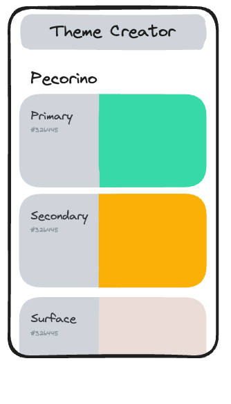

# Part 1: Display Single Theme

## Value Proposition

**As a** User

**I want to** view a single theme

**in order to** understand its color scheme and visual representation.

## Description

## Acceptance Criteria

- When I open the app, I can see a single theme displayed.
- The name of the theme is displayed.
- Each color in the theme is represented by a color card.
- Each color card displays:
  - hex value of the color
  - the role of the color
  - the color itself.

## Tasks

- Set up a React component for displaying a single color card.
- Display hex values and roles on each color card.
- Style color cards to accurately represent the colors.
- Render color cards for each color in the theme.

## Notes

- Start your project with using the `npx create-react-app` command. Remove all boilerplate files and start with a fresh empty react project.
- Create a new file called `db.js` inside your projects `src` folder and copy the theme data from [this source](../assets/db.js) into it.
- Always work on your app in the **mobile view** of your browser. In firefox, you can activate it with the shortcut `cmd+alt+m`.
- For every component, create a corresponding `css` file with the same name and import it at the top of your component file. Write all styles for the component in this css file.
  > 💡 Take a look at the data in the `db.js`. How is it structured? What keys belong to what element in the list? Make sure to understand the data structure before using it.
