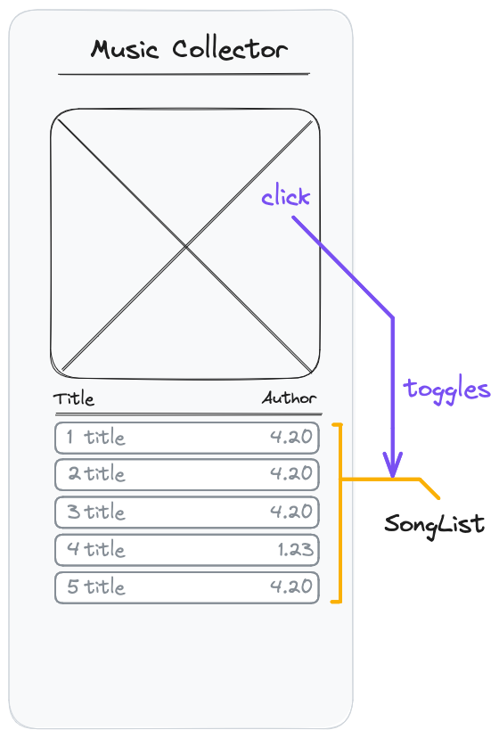

# React Recap Project - Part 2

## Features

Each album can be expanded by clicking on the album cover. If expanded, the track list of the album is displayed in the card.

## Acceptance Criteria

- By clicking on the cover of a closed AlbumCard, the card is expanded
- When the card is expanded, a list of songs is displayed
- Every song in the list has a track number, a name and a duration.
- By clicking a second time on the cover, the AlbumCard is closed
- A Component called `SongList` is created and used for rendering the list of songs

## Notes

- Each clickable item on a webpage must be either a link or a button (depending on the use case).
- A button with more than just text as children needs an aria-label for better accessibility.
- You will need a state somewhere in your application to toggle the Card display.
