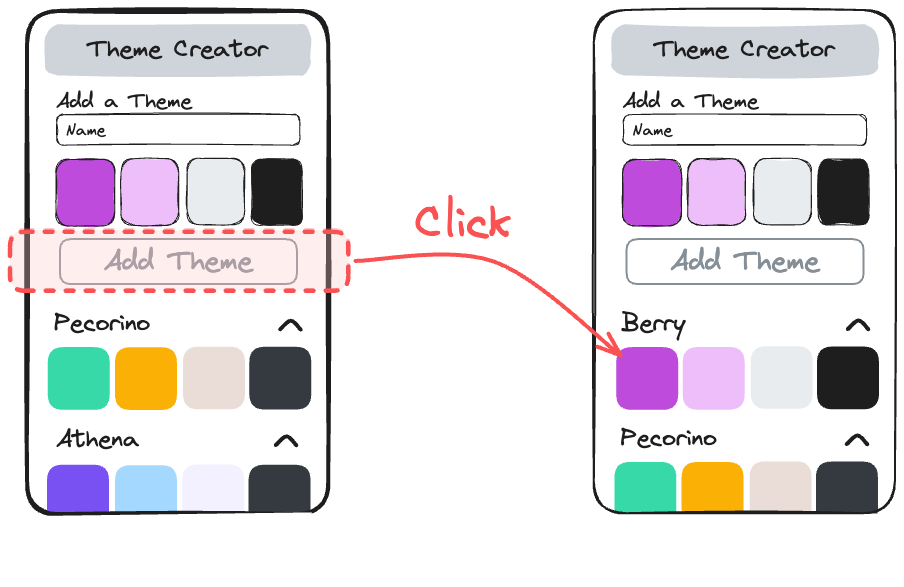

# Part 3: Theme Form for Adding Themes

## Value Proposition

**As a** User  
**I want to** add new themes with ease  
**in order to** customize and manage my color schemes effectively.

## Description



## Acceptance Criteria

- There is a form displayed above the theme list for adding new themes.
- The form includes:
  - One text input field for entering the title of the theme.
  - Four color input fields for adding colors to the theme.
  - A submit button.
- Each color input field allows users to select colors through a color picker.
- A name must be provided to be able to submit the form.
- When the submit button is pressed, a new theme is displayed on top of the theme list.

## Tasks

- Create a React component for the theme form.
- Design the form layout with appropriate input fields for title and colors.
- Use uncontrolled inputs and give the input fields a `defaultValue`.
- Make the name input required.
- Inside `App.js`, create a new state called `themes` and paste the themes from the `db.js` as the initial value.
- Create a function called `handleAddTheme` with a `newTheme` parameter which adds it at the top of the theme array state.
- pass the `handleAddTheme` function to the theme form component.
- Test the form to ensure it successfully adds themes with titles and colors.

## Notes

- Your new themes need a random id, you can use `uuid` for that:

  ```js
  import uuid from "uuid";

  const randomId = uuid.v4();
  ```
