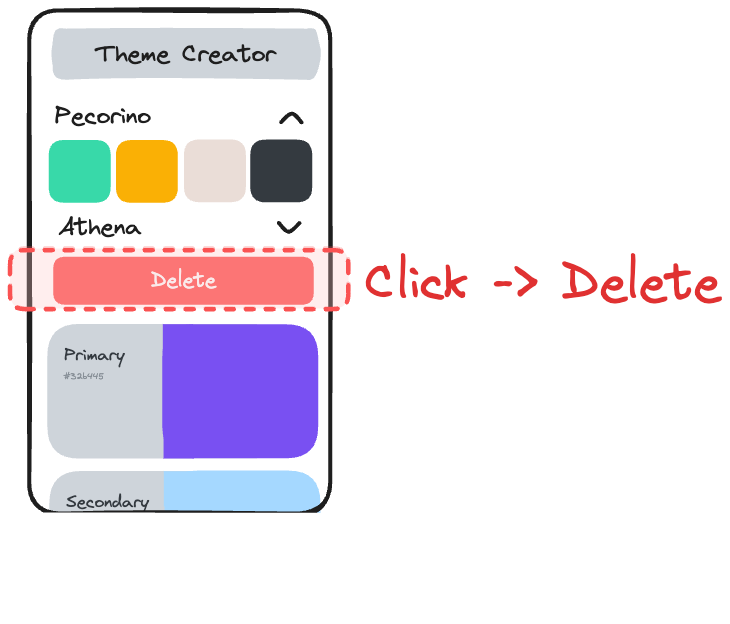

# Part 4: Add Delete Button

## Value Proposition

**As a** User

**I want to** delete themes when needed

**in order to** manage my list of themes effectively.

## Description

## Acceptance Criteria

- In the detail view of a theme, there is a delete button displayed.
- The delete button is clearly labeled and easily identifiable.
- Clicking on the button deletes the theme from the theme list.

## Tasks

- Enhance the detail view component to include a delete button.
- In `App.js`, create a function `handleDeleteTheme` and implement the functionality to handle the delete action when the button is clicked.
- Ensure that deleting a theme updates the theme list appropriately.
