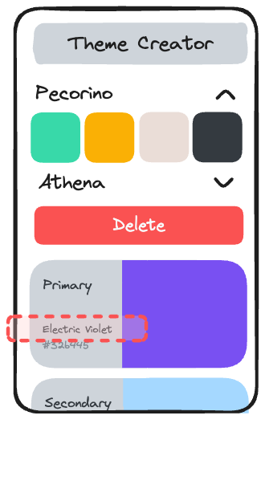

# Persist Theme State and Fetch Color Names

## Value Proposition

**As a** User  
**I want to** persist my themes  
**in order to** retain my customized color schemes even after closing the app.

## Description



## Acceptance Criteria

- The app uses the `use-local-storage-state` hook to persist theme data locally.
- Color names for each color in the theme are fetched from `www.thecolorapi.com`.
- Fetched color names are displayed alongside the color cards in the theme detail view.

## Tasks

- Install `use-local-storage-state` with npm.
- Integrate the `use-local-storage-state` hook to manage theme state persistence.
- Inside the `ColorCard` component, create a local state for the color name.
- Use the `useEffect` hook to fetch the color name from [the color api](https://www.thecolorapi.com) and update the color name state.
- Enhance the color card component to display the color name fetched from the API.
- Test the persistence of theme state across app sessions.
- Test the fetching and display of color names to ensure accuracy.

## Notes

- `use-local-storage-state` works a bit different from `useState`. It gets two inputs: `storage-key-string` and an `options` object. inside the options object you can define the `defaultValue`:

  ```js
  {
    defaultValue: // your initial value for the hook if no storage value is found
  }
  ```

- 💡 If something does not work properly try to clear the local storage 🤓.
- You can pass a color value to `thecolorapi` like this:
  ```
  https://www.thecolorapi.com/id?hex=<color hex value>
  ```
- ❗ Its important to remove the `#` from the hex value before passing it to the API: `FF0000` instead of `#FF0000`.
- 💡 The hex value describes the color with 3 concatinated hexadecimal (16) numbers, e.g. `FF0005` means `FF (= 255)` red, `00 (= 0)` green and `05 (= 5)` blue.

> ❗ This way of fetching the color names is very inefficient. Every creation of the color card will refetch the name information. In [part 8](../part-8/readme.md) we will implement a more efficient solution.
