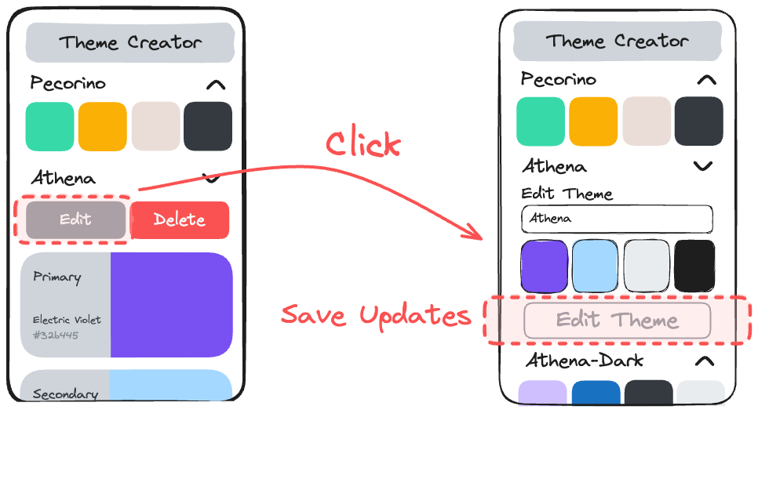

# Part 6: Edit Form

## Value Proposition

**As a** User  
**I want to** edit themes easily within the detail view  
**in order to** customize my color schemes with precision.

## Description



## Acceptance Criteria

- In the detail view of a theme, there is an edit button displayed.
- Clicking on the edit button reveals an edit form within the detail view.
- the edit form contains:
  - a title "Edit Theme"
  - a title input
  - 4 color inputs
  - a submit button.
- The initial values of the inputs reflect the selected theme.
- The edit form allows users to modify the title and colors of the theme.
- Clicking the submit button applies the changes to the theme and returns to the detail view of the theme.

## Tasks

- Implement an edit button in the theme detail view.
- Create an edit form component to allow users to modify theme details.
- Implement functionality to toggle the visibility of the edit form upon clicking the edit button.
- In `App.js`, integrate the edit functionality in a new function `handleEditTheme`.
- Test the edit functionality thoroughly to ensure accurate updating of theme details.

## Notes

- 💡 (Optional) You can reuse the `ThemeForm` component instead of creating a new component. You need to update the component accordingly to accept default values.
- Toggling between preview, details and edit form can become quite messy. Instead of using a "boolean" state, you can store the current display state as a string (`"preview"`, `"details"` or `"edit"`). Then use conditional rendering to display only the elements that correspond to that display state:

  ```jsx
    {displayState === "preview" && <ThemePreview ... />}
    {displayState === "details" && <ThemeDetails ... />}
    {displayState === "edit" && <ThemeForm ... />}
  ```
