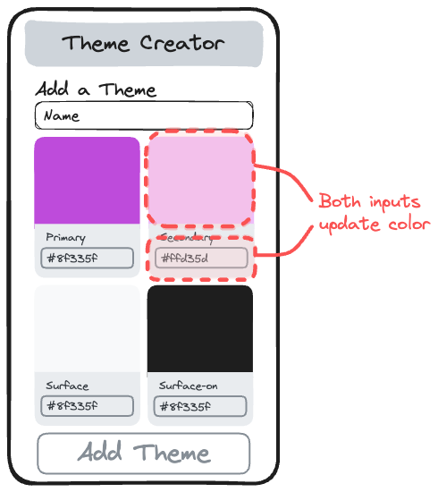

# Part 8: Advanced Theme Form and Color Name Fetching

## Value Proposition

**As a** User

**I want to** have more control over theme creation with advanced form inputs

**in order to** precisely customize color schemes and ensure accuracy.

## Description



## Acceptance Criteria

- The theme form includes advanced inputs for both color and text inputs for hex values.
- each color input includes:
  - a color input
  - a label displaying the color role
  - a text input for hex values
- Users can either select colors from a color picker or manually enter hex values.
- The color or hex value inputs are synced to always display the same color.
- Color names are fetched directly when a theme is created or updated and are stored in the theme data.

## Tasks

- Create a component `ColorPicker` and use it instead of the color inputs in the them form component.
- add a color input as well as text input to the color picker component.
- Update the form to reflect changes instantly as users input colors or hex values.
- Test the controlled inputs to verify that changes are accurately reflected and validated.
- Remove the color name fetching inside the color card component.
- Update the `handleAddTheme` and `handleEditTheme` functions to fetch the color names of all colors and add them to the color objects.
- Update the color card component to use the stored name value `color.name`.

## Notes

- You might need a local state inside your color picker component and make both inputs dependent on this state.
- You can pass an `async` function to map, but it will return an array of `Promises`:
  ```js
  const promises = colors.map(async (color) => {
    // do stuff
  });
  // promises === [<Promise "pending">,<Promise "pending">,...,<Promise "pending">]
  ```
- You can wait for multiple Promises to resolve with the method `Promise.all()`:
  ```js
  const values = await Promise.all(arrayOfPromises);
  // values === [value1, value2,...,valueN]
  ```
- You reached the final part of this project. Great job! This one is quite advanced, don't give up and good luck! 🚀
