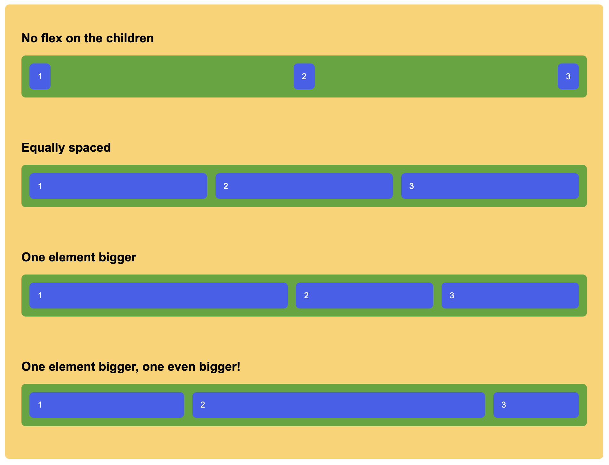

# Additional Flex component

## Task

Reproduce the following scenarios using flex:

## Notes

- You only have to touch the `./styles.css` file.

## Development

### Local development

Use the Live Preview Extension for Visual Studio Code to view this project in
the browser.  
Select the HTML file you want to view, press
<kbd>⇧</kbd><kbd>⌘</kbd><kbd>P</kbd>, search for `Live Preview: Show Preview` and confirm with <kbd>Enter</kbd>.
